#  RTW & M2TW Campaign Editor

**An editor for the campaigns of Rome: Total War (with REX) and Medieval II: Total War (with M2EX)** - factions,
the campaign map, towns, armies, characters, units, buildings, diplomacy, texts and pictures, in a window, with a
preview of every change and a backup you can always go back to. Version **0.33.0**.

[](../../releases)
[](../../wiki)
[](https://ko-fi.com/pfadfinder)
[](https://www.youtube.com/channel/UC8j5rv6mTmtvRR8u7NmaCvQ)
[](https://discord.gg/uqA9MEn4Z)

**[⬇ Download](../../releases)** · **[📖 Wiki - step by step](../../wiki)** · **[🗺️ Roadmap](ROADMAP.md)** ·
**[📝 Changelog](CHANGELOG.md)** · **[🙏 Credits](CREDITS.md)** · **[🐞 Something went wrong?](#something-went-wrong)** · **[☕ Support](#-why-support-it)** ·
**[💬 Discord](https://discord.gg/uqA9MEn4Z)** · **[🔒 Security](SECURITY.md)** · **[⚖️ License](#license)**

> [!IMPORTANT]
> - **Download only from this repository's [Releases](../../releases) page** - never a copy from another site or a chat.
> - **Close the game before writing**, and keep REX / M2EX beside it: with them the editor knows no limits at all (no refusal, no warning - their setting lines are rewritten to fit); the original exes' limits apply only without them.
> - **Nothing is lost:** every change is shown first (Preview) and written with a backup; **Restore** gives the files
>   back byte for byte. Undo / Redo work in the window.
> - **Something wrong?** **Report a bug / Suggest** (bottom right) sends the logs in one click - see [below](#something-went-wrong).
> - Features marked 🧪 in the [Roadmap](ROADMAP.md) are out but not yet confirmed in the game - reports welcome.

## ☕ Why support it

I'm building a tool that finally lets us improve the games of our childhood ourselves - without digging through files
every time, without the fear of breaking something, and without everything falling apart because we forgot one step.
The editor is free and stays free. It is built with the help of AI, which costs money every month; if the tool saves
you time, a coffee on [Ko-fi](https://ko-fi.com/pfadfinder) keeps new features coming. I'm building this on my own on
an old laptop: a small contribution would also help me finally get a proper gaming PC, a childhood dream, and give the
editor more time and faster testing (big mods and both games load slowly on the old machine). Thank you!

## 🤝 Made a mod with it?

If the editor helped you build or change a mod, please say so where you share the mod (its page, readme or forum
thread) and link to the editor, so other modders can find it too. One line is enough - copy one of these:

```
Made with the RTW & M2TW Campaign Editor: https://github.com/MasterOogwayHomebrew/RTW-M2TW-Campaign-Editor
```
```
Made with the [url=https://github.com/MasterOogwayHomebrew/RTW-M2TW-Campaign-Editor]RTW & M2TW Campaign Editor[/url]
```
(the second one for forums such as TWC). It is a request, not a condition - thank you!

## 🎯 What this tool is for

One goal: **a bridge between the modder and the game's files.** The editor gives you access to every corner of the
game's data - factions, campaign map, towns, armies, characters, units, buildings, diplomacy, texts and pictures - for
Rome: Total War (with REX support) and Medieval II (with M2EX support), and takes over the slow part: finding the
right files and lines, keeping the tied ones in step, checking for what the game would crash on.

It is for anyone who mods:

- **Mod teams** - work that took hours of file digging done in minutes.
- **Beginners** - a place to start making something of your own without learning every file format first.
- **Players** - something of your own in your favourite mod, just for yourself: a faction you always wanted to
  see, different starting positions, a changed map. Nothing has to be published.

What it is not: a 3D modelling program. Models can be viewed and swapped between units, but making or editing
models is left to the tools built for that. The one exception: recolouring the faction colour painted on a unit's
texture (vanilla-style uniforms), so a new faction's troops wear its own colour (Art tab > Recolour).

## 🚀 Quick start

1. **Download** `RTW-M2TW-Campaign-Editor.exe` from [Releases](../../releases) and put it into the **game's folder**
   (beside `RomeTW.exe` / `medieval2.exe`; REX or M2EX beside it is best - see *Works with*).
2. **Start it** and pick the game or the mod you build on (**Mod** at the top, or **Browse...** to its `data` folder).
3. **Make your own mod folder: New mod folder...** - the game (or the mod you build on) stays clean, its update never
   takes your work, and deleting your folder takes everything back. On the plain game it holds only what you change.
4. **Change something** - drag a town on the **Maps**, edit a faction, a unit, a building...
5. **Preview changes**, then **Apply changes** (a backup is made first).
6. **Start the game** with the green button (it names the mod it starts). Something wrong? **Undo this write**, or
   **Tools > Restore a backup** gives every byte back.

## 🧩 Works with

| Game | With the original exe | With the engine beside it |
|---|---|---|
| **Rome: Total War** (Gold / Steam) | `RomeTW.exe` - the game's own limits apply (21 factions, 200 regions...) | **REX** - no limits at all, wastelands, add-ons and your own modules |
| **Barbarian Invasion**, **Alexander** | `RomeTW-BI.exe`, `RomeTW-ALX.exe` | REX (`-bi`, `-alx`) |
| **Medieval II: Total War** (and its Kingdoms campaigns) | `medieval2.exe` / `kingdoms.exe` | **M2EX** - no limits, wastelands, add-ons and your own modules |

Any mod of these games loads - a whole one (HLR) or one that holds only the files it changes (the game reads the rest
from its own `data`, and so does the editor). Medieval II keeps its data packed: the editor offers to unpack it once,
with the game's own unpacker.

## ✨ What's new

**0.33.0** ([release](../../releases/tag/v0.33.0)): units, buildings and religions made from nothing; your own files
for a unit's battle model; the map's size changed by dragging its edges; regions merged; many towns deleted at once;
a town's own garrison. **Coming next** (in the newest test builds): a deleted town's region kept as a wasteland,
thin mods from New mod folder, much faster on big mods. Everything: [CHANGELOG.md](CHANGELOG.md).

## 🗺️ Rescale the whole campaign map 3 x

**Bigger map (x3)...** (Maps, beside the zoom) (beta), Rome (REX) and Medieval II (M2EX). Each tile of
`map_regions.tga` becomes a 3 x 3 block; everything tied to the map is converted with it:

- **Positions** (`descr_strat.txt`, `descr_events.txt`, ...): towns, characters, fleets, resources, forts,
  watchtowers, wonders and event places go to the middle of their new block.
- **Coast and borders**: natural - the coastline winds with bays and capes and the borders between regions wind
  too, instead of 3 x 3 squares and straight 45-degree cuts (two waves whose sizes stand in the golden ratio bend
  them, so the pattern never repeats; the same map always comes out alike); every block's middle keeps its old
  value, so nothing changes under a town, army or resource, and every region stays in as many pieces as before. The rules the games' own maps keep are kept: every town has its own region (or sea) all round it,
  every port stands on a coastal land tile touching the sea and its region, and a region `descr_regions.txt` does
  not list still counts as land.
- **Heights**: `map_heights` the natural way - bent with the ground, crags on the mountains (plains stay flat),
  volcanoes keep their cones, lakes get gentle banks, land touching water stands clearly above it (no flickering
  wedges on the coasts, no islets in navigable rivers),
  every river in its valley, no slope steeper than the old map's steepest -, with **the same coast as `map_regions`** (every
  tile's middle point is sea exactly when the tile is - as in both games' own maps), and
  **`map_heights.hgt`** - the game's float copy, which it reads instead of the picture and never rebuilds - written
  at the new size too. The hills, mountains and sea floor are made **3 x higher** (`max_land_height`,
  `min_sea_height` in `descr_terrain.txt`): the land is 3 x wider, so the slopes stay as steep as they were
  (or keep the old heights - a choice in the window). The sea ground types follow the heights' new coast.
- **Rivers**: 1 pixel wide (the game crashes on a 2-pixel river), drawn the way rivers run - bends rounded, gentle
  meanders on straight runs (never twice the same, the same map always alike), side by side pixels only; a river mouth runs on to the new coast and ends on the land touching the water - never a pixel on the water (no land is left under it). Medieval II's land bridges stay unbroken lines too. No cliffs and no beach are drawn (paint them where wanted). Small islands and lakes keep their size and come out round (no crosses or clovers), capes one tile wide stay whole strips; the sea along the coast is shallow, the line to the deep water smooth.
- **Ground and climates by tile**: every new tile gets the ground type and climate of the old tile it lies in (a
  forest stays a forest), the edges where two kinds meet winding as the coast does - no 3 x 3 steps.
- **Pictures**: `map_trade_routes`, fog, roughness, disasters and radar maps scaled with exact colours.
- `descr_terrain.txt` gets the new size; `map.rwm` is deleted so the game rebuilds it.
- Preview of every file, one backup, Restore byte-exact.

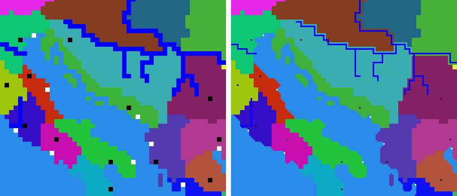

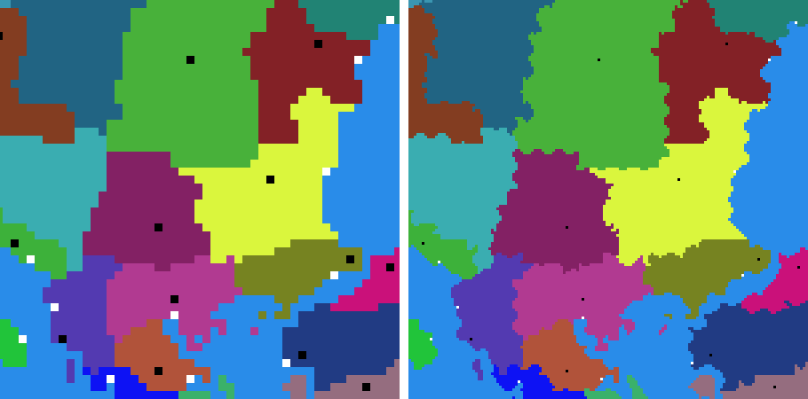

Scripts follow too: every campaign-map place in the campaign's scripts (spawned armies and characters, `reposition_character`, `move`, the camera, `reveal_tile`, forts and resources made by `console_command`, 'near a tile' and 'in a rectangle' conditions) goes to its block; battle positions in the same scripts stay. Lines the editor cannot read for sure, and Lua / Squirrel scripts that place things by tile (not the engines' own interface scripts), are listed to check by hand.
Without REX / M2EX the original exes stop at
510 tiles - the tool warns. Checked on both vanilla campaigns (103 / 112 towns, 177 / 216 characters, 75 / 77 ports
in place, no river on the sea, every river end at the sea, a river or the map's edge as in the original). The first
alpha (0.24-0.27) left the old `map_heights.hgt` in place and kept the heights - flat, square-coasted maps; make the
map again from a backup with this version. Video of the first alpha: [rescaling the whole map](https://youtu.be/kkfI-WulRmU).

[](https://www.youtube.com/watch?v=m1sCPg-Lzsw)

**▶ Video overview:** [what the editor does, in a few minutes](https://www.youtube.com/watch?v=m1sCPg-Lzsw) (click the picture above).

### 🎬 More videos

All on my YouTube channel **[Pfadfinder](https://www.youtube.com/channel/UC8j5rv6mTmtvRR8u7NmaCvQ)** - each one checked in the game:

<table>
<tr>
<td align="center" width="25%"><a href="https://youtu.be/z0T723riXaU"><br><b>▶ Editing rivers, fords, cliffs</b></a></td>
<td align="center" width="25%"><a href="https://youtu.be/mTdRAWympuw"><br><b>▶ Editing a height map</b></a></td>
<td align="center" width="25%"><a href="https://youtu.be/6WAdnGovGzA"><br><b>▶ Searching the map for settlements and units</b></a></td>
<td align="center" width="25%"><a href="https://youtu.be/umwRyWkHoDE"><br><b>▶ Settlement names by culture</b></a></td>
</tr>
</table>

### 🖼️ A look inside

<table>
<tr>
<td align="center" width="50%"><a href="docs/images/edit_faction.png">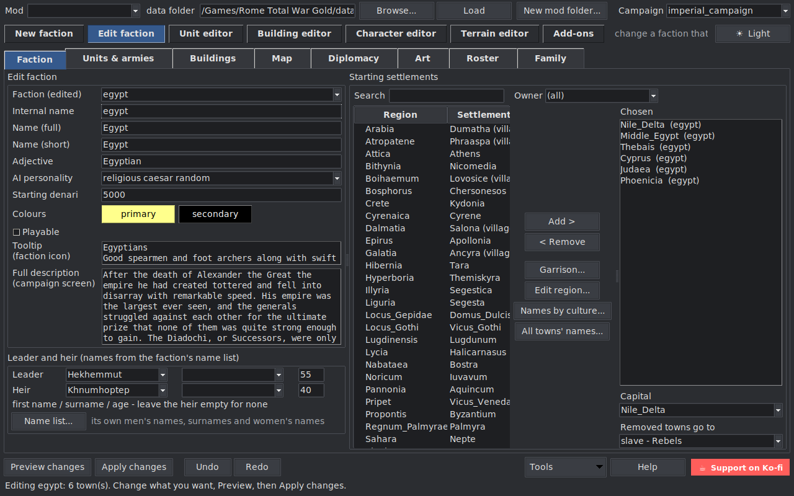</a><br><b>Edit a faction</b> - names, colours, money, towns taken or given</td>
<td align="center" width="50%"><a href="docs/images/map.png">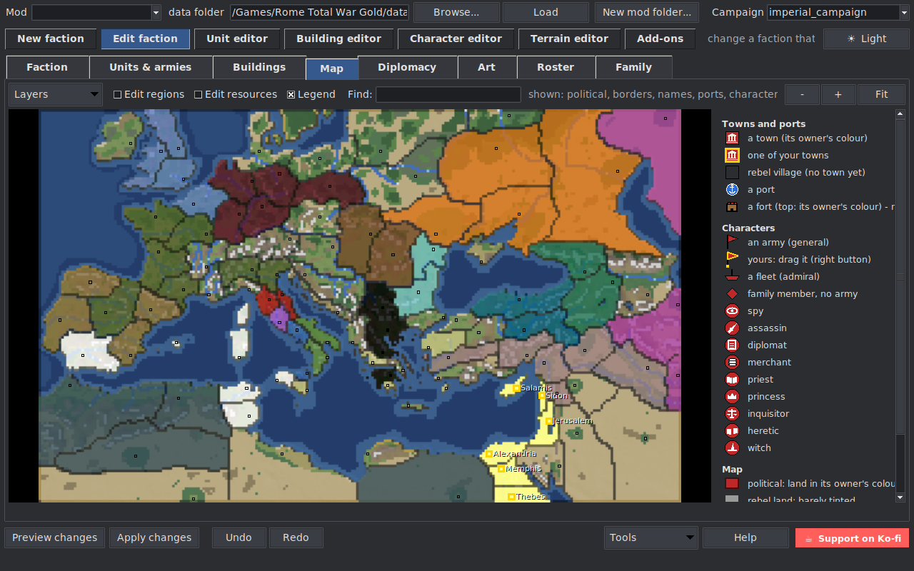</a><br><b>The campaign map</b> - owners, towns, ports, characters to drag</td>
</tr>
<tr>
<td align="center"><a href="docs/images/terrain_editor.png">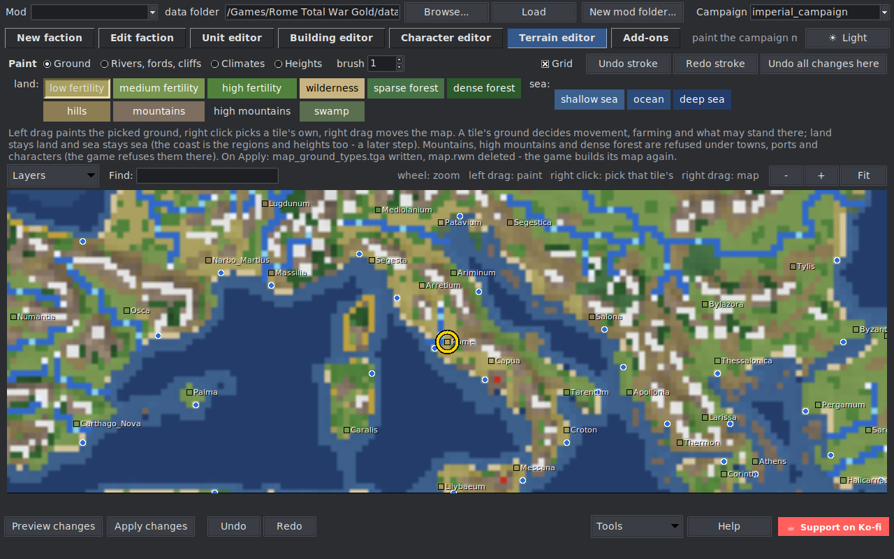</a><br><b>Terrain editor</b> - ground, rivers, climates and heights, tile by tile</td>
<td align="center"><a href="docs/images/character_editor.png">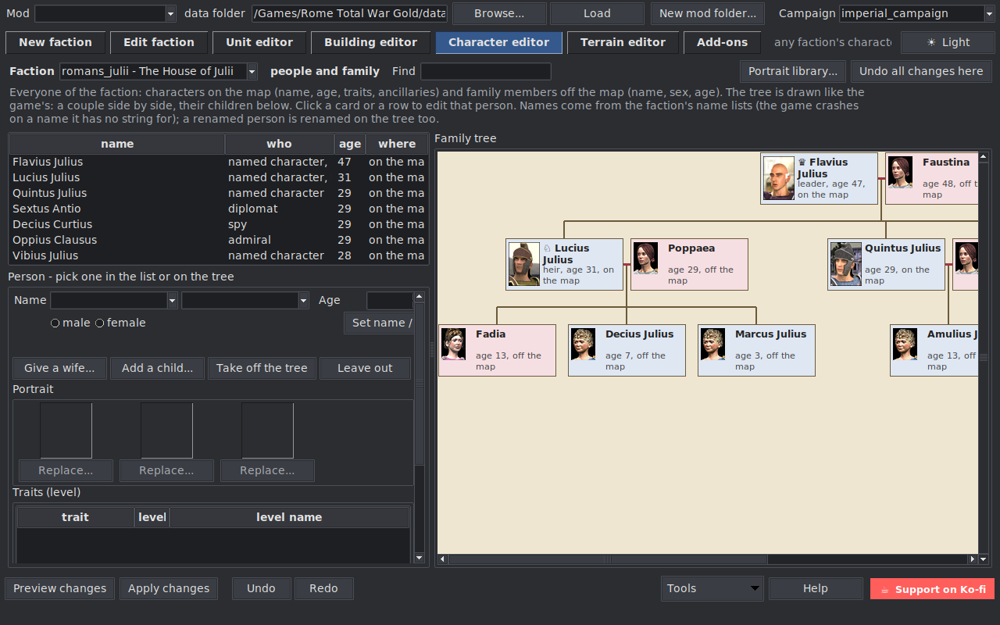</a><br><b>Characters</b> - the family tree with the game's portraits</td>
</tr>
<tr>
<td align="center"><a href="docs/images/unit_editor.png">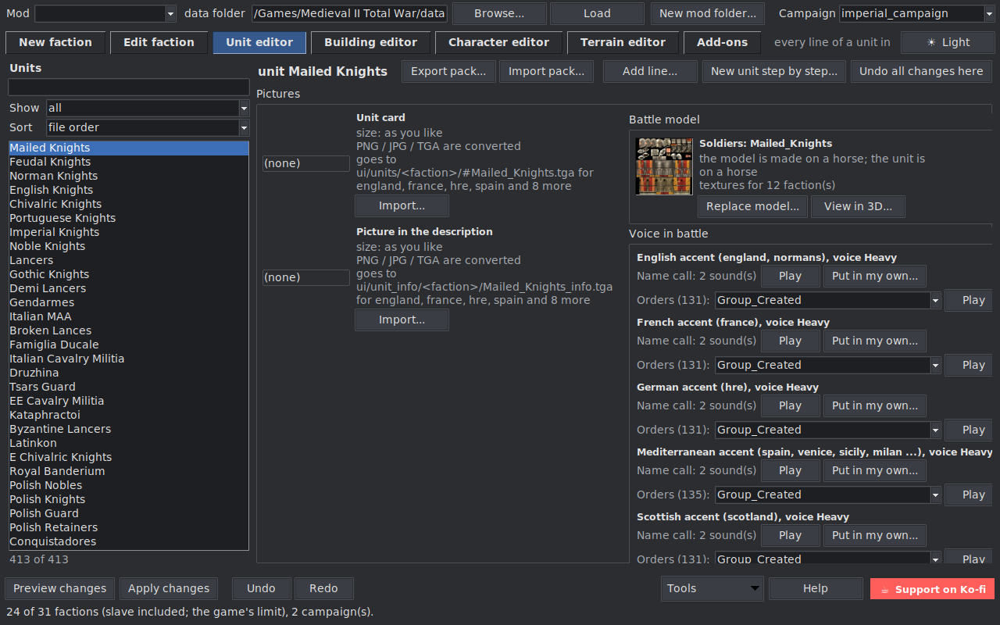</a><br><b>Units</b> - cards, battle model, the unit's voice, every line</td>
<td align="center"><a href="docs/images/view_in_3d.png">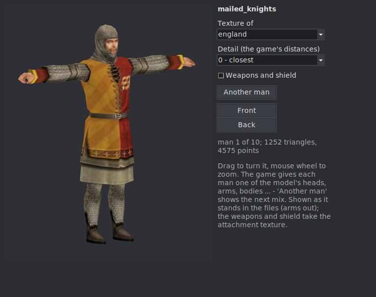</a><br><b>View in 3D</b> - a Medieval II battle model with its faction's texture</td>
</tr>
<tr>
<td align="center"><a href="docs/images/view_in_3d_rome.png">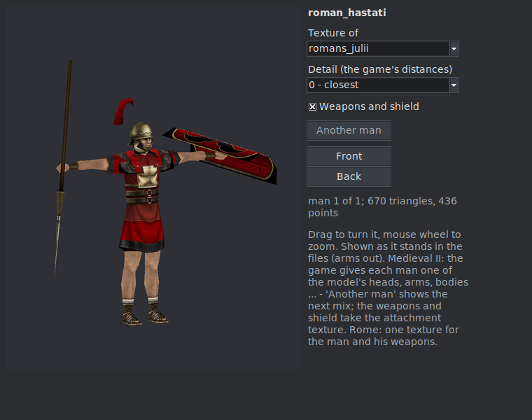</a><br><b>View in 3D, Rome</b> - a Rome battle model (.cas) with its faction's texture</td>
<td align="center"><a href="docs/images/module_builder_blocks.png">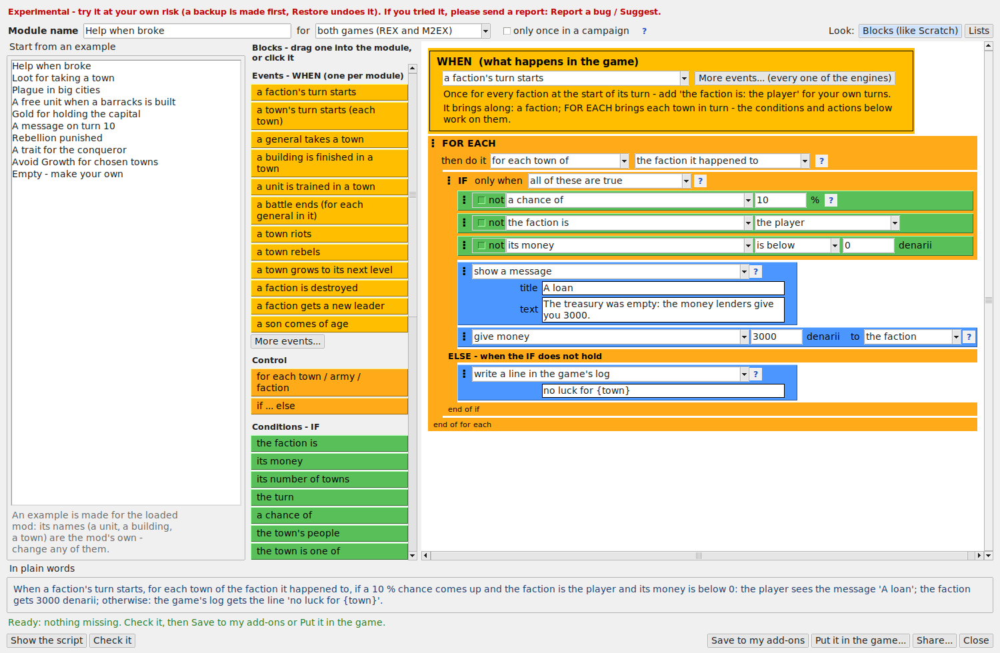</a><br><b>Module builder</b> - your own game scripts made of blocks, like Scratch</td>
</tr>
<tr>
<td align="center"><a href="docs/images/campaign_rules.png">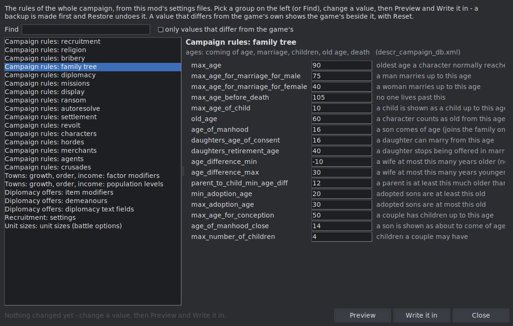</a><br><b>Campaign rules</b> - every setting of the campaign in plain words</td>
<td align="center"><a href="docs/images/addons_sack_settlement.png">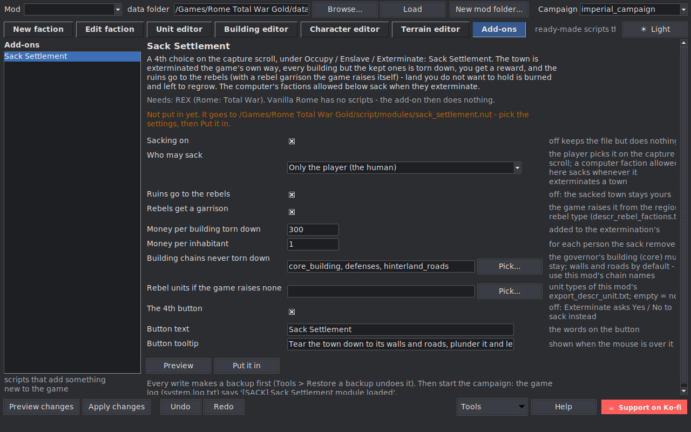</a><br><b>Add-ons</b> - Sack Settlement for Rome + REX, with who may sack</td>
</tr>
</table>

## 🧰 What it can do - at a glance

| Area | What you do there |
|---|---|
| **Factions** | a new faction cloned from another (or edited): names, colours, money, towns, leader and heir, garrisons, buildings, diplomacy, victory conditions; a faction renamed everywhere |
| **Campaign map** | towns, ports, armies, agents and fleets dragged; regions painted, renamed, merged or deleted (a wasteland with REX / M2EX); the map grown, cut or made 3 x bigger; terrain, rivers, climates and heights painted |
| **Units and buildings** | every line as a field; new ones step by step or from nothing; models swapped, your own textures and models put in, voices heard; brought from another mod or a unit pack |
| **Characters** | traits, retinue, ages, names; the family tree as the game draws it |
| **Pictures** | every picture of a faction replaced, recoloured to its colours, its emblem and banners made |
| **Rules and scripts** | every campaign setting in plain words; add-ons (Sack Settlement, Avoid Growth, Player Diplomacy) and your own modules made of blocks, like Scratch |
| **Safety** | a mod folder of your own, a preview of every change, backups with Restore, Undo / Redo, Check mod files, a log |

<details>
<summary><b>Every feature in detail</b> (click to open)</summary>

Medieval II: the tool loads and edits it (factions, towns, map, its agents such as merchants, priests and princesses, religions, character lines as Medieval II writes them). Medieval II keeps most data in `packs`: load the game folder (or a Kingdoms campaign's folder, such as `mods/british_isles`) and the tool offers to unpack it with the game's own unpacker (its `unpack_all.bat`, or the campaign's own `unpack_britannia.bat` and the like; it copies the two DLLs the unpacker needs, `msvcp71.dll` and `msvcr71.dll`, from the game folder next to it). Set-up problems that stop the game from starting (M2EX's `vegetation_source text` without the raw vegetation maps) are found on Load and fixed with a yes.

- **New factions** cloned from a template: names, texts, colours, units, buildings, cards, start towns, leader and heir, garrisons, buildings, diplomacy (alliances and wars at the start), victory conditions.
- **Characters and the family tree**: traits, ancillaries, ages and names of every character, family members off the map, and the family tree drawn like the game's.
- **Name lists of its own**: a faction's men's names, surnames and women's names typed in three steps (one per line or separated by commas), written into `descr_names.txt`, `names.txt` and the lookup together; names its characters already carry are kept.
- **Medieval II battle models (`battle_models.modeldb`)**: a new faction gets its template's textures in every battle model (read and written byte-exact, 701 vanilla models); unit packs carry their modeldb models, renamed on clashes and textured for every new owner, kept in step with `descr_model_battle.txt`.
- **City or castle (Medieval II)**: turn a settlement into a castle or a city on the Buildings tab - `settlement castle` and its buildings converted the game's own way (`convert_to`), only the kind's buildings offered.
- **Edit existing factions**: names and texts, colours, AI, money, playable, towns taken or given, capital, leader and heir, garrisons, buildings, settlement size, armies, fleets and agents, diplomacy (alliances and wars at the start), victory conditions.
- **Campaign map**: **Find** a town, port, character, unit, fort or resource by name; the map drawn from the ground types, political and diplomacy colours, towns, ports and characters you can drag, new armies, agents and fleets placed by clicking, towns and ports moved, **new regions painted** and borders moved, two regions **merged** into one, **resources**, **forts and watchtowers** placed, moved and removed, **events** (plagues, volcanoes, historic messages: date, place, texts), religions (Medieval II, Barbarian Invasion - a new one from nothing: its symbol drawn, temples of its own), **settlement names by the owner's culture** (REX on Rome, M2EX on Medieval II renames a town when it changes hands; the map shows the new owner's name at once; every town's names in one table, sorted and filtered by culture; [video](https://youtu.be/umwRyWkHoDE)). Big maps load: a tester's map of 5456 x 2464 tiles (map_regions.tga pixels) opened and edits fine.
- **Unit and building editors**: every line of a unit or building chain as a field, pictures imported in the right size and format into the right place; **new units and buildings step by step** (names and texts, who owns it, its numbers, pictures - Back / Next between the steps, everything shown before it is added) - a unit or a building chain as a copy of one, or **from nothing**: say what kind it is and the editor writes every line, its numbers starting at what is usual for such a unit / building in this mod (a building: its levels side by side, any effect the mod's buildings use, the units it trains, plain pictures drawn when you have none).
- **Battle models**: **Replace model...** gives a unit another model from this mod or another mod of the same game (it comes with its files; the unit's factions get textures on it; a model made to sit otherwise - on foot, horse, camel, elephant, chariot - is warned about). **View in 3D...** shows the model with a faction's texture - Medieval II's `.mesh` and Rome's `.cas` alike: turn it with the mouse, zoom, the game's detail levels, weapons on or off - and play any of its moves (stand, run, attack, shoot...) straight from the game's animation packs, Play / Pause or a frame at a time.
- **Unit voices**: hear what a unit says in battle - its own name call and every order - straight from the game's sound packs, for each accent (Medieval II) or culture (Rome) of its owners, and put in your own `.wav` as its name call.
- **Campaign rules** (top row): every value of the campaign's settings files with a plain explanation - the campaign's start / end date, years a turn and switches (night battles, Marian reforms, rebelling generals...) from `descr_strat.txt`; Medieval II's ages, agents, revolts, crusades, bribery, how towns grow, riot and pay, diplomacy, recruitment; Rome under REX the people each settlement level needs; the Unit size choices of REX / M2EX. The game's own value shows beside a changed one.
- **Add-ons**: ready-made scripts that add something new, put in with their settings picked in the tool. **Sack Settlement** (Rome + REX): a 4th choice when a town is taken - torn down to its walls and roads (the governor's building always stays, 600 people at least), a reward, the ruins left to the rebels; pick who may sack (only the player, everyone, hordes, picked factions). **Sack Settlement (Medieval II)** (M2EX): the same as a 4th button under Occupy / Sack / Exterminate, drawn from the game's own button pieces (its words: Raze Settlement, as the game's own Sack is already there). **Avoid Growth** (both games): a tick on your town's scroll - the town keeps at most the people it has when ticked, may shrink and grows back up to that. **Anyone's add-on**: Add an add-on... takes any REX / M2EX script (`.nut`, or a zip) - its settings are found by themselves; **Share...** packs one as a zip for others. **Scripts in the game**: every script in the game's `script/modules` with its settings, off / on, delete - the test mod's taken out with one press. **Module builder** (both games): your own add-on made of blocks, no code - WHEN something happens, IF conditions hold, DO actions, picked from lists in plain words with the mod's own names, plus any event, condition, console command or campaign-script command of the engines' own lists (Pick... with a search, parameters as fields) and numbers kept between turns; nine examples to start from.
- **Faction names as players see them**: lists show "turks - Ryazan" when a mod keeps the game's internal name and shows another.
- **Check and install a pack**: a mod that says "copy data over the game" is checked file by file first - what is new, what it would replace and lose (REX's own files, pictures of another size such as interface icon pages, another mod's whole text file) - and put in only as you pick: whole files, only a text file's changes, or not at all, with a backup and Restore.
- **Bring units and buildings from another mod**: straight from its folder, step by step - pick the mod, tick the units or building chains, their names here, who has them, where they are recruited (or which of your units a building recruits), then Preview and write with a backup. Everything they need comes along (models, textures, cards, texts, level pictures); what is left to finish by hand is said. Guide: [Move units and buildings between mods](../../wiki/Move-units-and-buildings-between-mods).
- **Unit packs (export / import)**: take units out of one mod with everything they need - their models (`descr_model_battle`), mount, engine, animal, textures, sprites, cards, names and descriptions and where they are recruited - into one `.zip`, and put them into another mod of the same game. Names that are taken get free ones, nothing of the target mod is overwritten, and it is written with a backup like every change.
- **Faction art**: every picture of a faction listed and replaceable - the campaign-select map and the leader's face on the faction tab itself, under Victory (a new campaign-select map drawn from the towns is put away for now - the original stays); **figures on the campaign map**: each character type's strat model picked, seen in 3D, its texture replaced.
- **Terrain editor** (Maps' Terrain and Coast & heights tabs): paint the campaign map's ground (fertility, forest, hills, mountains, swamp, seas), rivers, fords, cliffs and climates, and the land's heights with a spray brush (raise, lower, smooth, level) - checked in the game on Rome and Medieval II.
- **Characters**: any faction's characters - names, ages, traits, ancillaries - shown as the game's character panel (portrait, attributes as pips, traits by the names players see, the retinue as picture cards), the family tree a click away, **Traits and retinue...** to edit the traits and ancillaries themselves (what each level gives, the names and texts players see, the retinue's pictures, new ones as copies), the portraits the game shows, a portrait library per culture to add new portraits to; Medieval II characters get portraits of their own (Replace...).
- **Safe**: a separate mod folder in one click, preview of every file and line, backups with Restore, Undo/Redo in the window, Check mod files, and a log.

</details>

<a id="something-went-wrong"></a>

> [!IMPORTANT]
> ### ⚠️ Something went wrong? Send the logs - and a video or screenshot ⚠️
> When the game crashes, the tool shows an error, or something looks wrong, please send:
> 1. **The logs:** in the tool, **Report a bug / Suggest** (bottom right) sends them (and the list of the mod's files -
>    names and sizes, no contents) to the author in one click - no account needed, your names cut out first (Windows user name, computer name, e-mail, Steam ID, the player's
>    name), and you see exactly what goes before you press Send ([video](https://youtu.be/7MbYR9ywNsI)). Or **Tools -> Save logs (zip)** - the same logs,
>    names cut out, as one `.zip` in `CampaignEditor_logs` next to the exe, to send yourself.
> 2. **A video or a screenshot** of what you did and what went wrong.
>
> With these the cause is usually found and fixed **the same day** (the logs name the file, line and
> the game's own error); without them it is guesswork and takes much longer.

**Every report really arrives**: each one - bug or idea - lands in the author's private inbox as its own numbered
entry with the logs attached, and is read. The search box on the Units & armies tab came from one of them.
**And the answer comes back**: the author's reply to your report shows up in the editor itself - the report window's
tab **Answers to my reports** (the Report button says "(1 new)" when one came) - and **Send the answer** replies with
more words or a screenshot, to the same report. No account needed.

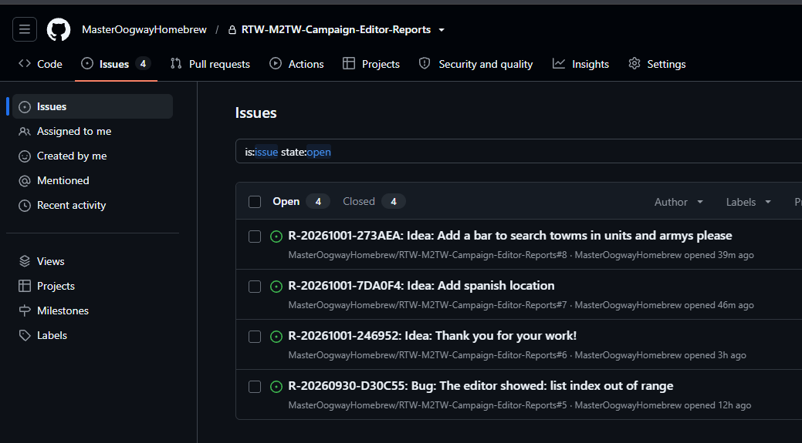

A step-by-step guide is in the [Wiki](../../wiki); [ROADMAP.md](ROADMAP.md) says what it does, what is being tested and what comes next, [CHANGELOG.md](CHANGELOG.md) what is in each version and what has been tested in the game.

Tested on the plain games - Rome: Total War (with REX), Barbarian Invasion, Medieval II: Total War (with M2EX) - and on testers' mods (Barbarian Empires REX Ultimate Edition / HLR, Kirsi's Bigger Map and others). It reads a mod's own files and assumes nothing about their contents, so other mods of these games should work too. Reports are welcome.

## Download

> ⚠️ **Only download the editor from this repository's [Releases](../../releases) page** (or a link the author posted or approved). Never take the exe - or a "fixed" / "patched" copy of it - from another site, a file-sharing link or someone in a chat, and don't pass it on that way: a copy from elsewhere can be changed to harm your PC. Share the link to the Releases page instead.

- **Windows:** grab `RTW-M2TW-Campaign-Editor.exe` from the [Releases](../../releases) page. No install needed.

**Installing:** put the `.exe` into the **game's folder** (beside `RomeTW.exe` / `medieval2.exe`, where REX or M2EX also goes) and start it from there - or make a shortcut to it on the desktop. Started from elsewhere (Downloads, the desktop), it offers once per version to put itself there: pick the game's folder (it checks the game is there) and it copies itself over with its settings, adds a desktop shortcut if you like, and starts from there. It then finds the game and every mod in it by itself (Rome: `<game>\<mod>`, Medieval II: `<game>\mods\<mod>`); a mod of the other game, once loaded with Browse..., stays in the Mod list too. Beside the exe it keeps just two things of its own: `CampaignEditor_settings.json` and the folder `CampaignEditor_logs` - its log, the logs zips, and on every close a `sessions` folder with that session's log and a copy of the game's newest `system.log.txt` as `game_system.log.txt` (the game's own log - its errors are the game's; nothing to press, a bug report sends them). An update is simply the new exe in the same place. Older versions' `RTW-M2TW-Campaign-Editor-files` is moved in by itself. **Going back** to an older version: put its exe from [Releases](../../releases) in the same place - your mods, settings and backups stay; see [Installing](../../wiki/Installing#going-back-to-an-older-version).
- **Any OS with Python 3.8+:** `python campaign_editor.py` (standard library; Pillow for the pictures).
  **Linux:** the window needs tkinter and Pillow's Tk part, which many distributions ship apart from Python -
  Debian / Ubuntu / Mint: `sudo apt install python3-tk python3-pil python3-pil.imagetk`, then
  `python3 campaign_editor.py` (Fedora: `python3-tkinter python3-pillow-tk`; Arch: `tk python-pillow`).
  **Changing the code:** `python -m unittest discover -s tests` and `ruff check` (`pip install ruff`; the rules are
  in `ruff.toml`) - CI runs both before it builds the exe.

## Using it

**No scrollbars**: every list, table, page and read-only text scrolls by the mouse wheel, by **dragging** it with the left button (it follows the mouse, up / down and left / right) and by the **middle button**: press the wheel and move the mouse - the further from where you pressed, the faster it scrolls, both ways (held: it stops when you let go; a click: it goes on until the next click or Esc). A text you can type in keeps the left drag for selecting words. The map is as before (the right button moves it).

1. **Close the game** and press **Browse...** to pick the mod's `data` folder (for example `...\Rome Total War Gold\HLR\data`).
2. Pick the **campaign** (usually `imperial_campaign`).
3. Pick a **template**. The new faction gets its culture, units, buildings, character models, name lists, trait triggers and art.
4. Fill in:
   - **Internal name:** lower case, no spaces, for example `saba`.
   - **Name (full)**, **Name (short)** and **Adjective**, for example `Sabaean Kingdom`, `Saba`, `Sabaean`. The copied strings use them ("Sabaean Spy", "Your forces attack an army of Saba").
5. **Starting settlements:** filter by owner (for example `slave` for rebel towns), **Add >** (or Enter) to add, then pick the capital; a double click (or **Rename...**) changes the names players see of the region and its town.
6. **Leader** (and optionally the heir): first name and surname **from the template's name list**. The game crashes on a name that has no string, so the tool only accepts listed names.
7. Press **Preview changes** to see every file and edit. Nothing is written yet.
8. Press **Create faction**. Then start a **new** campaign; old saves don't know the faction.

**A separate mod (recommended):** press **New mod folder...** after loading the mod you build on (for example `HLR\data`). The tool makes `<game>\HLR_Saba\` next to it and loads it; the faction goes there, and `Start_HLR_Saba.bat` (your base mod's start script with `-mod:HLR_Saba`) starts it. The green **Start the game** button (bottom right, beside Tools; it names the mod it starts, amber when no mod is loaded) starts it from the editor, after checking that the start script's exe is there and a Medieval II `.cfg` names the mod's folder. The base is never touched. The game reads one `-mod:` folder and falls back to the game's own `data`, so a mod built on HLR holds all of HLR: every file is copied, so the new mod stands on its own (to share or zip). For a mod you keep to yourself, tick **Hard links instead of copies**: text files are copied, everything else is a hard link (the same file on disk under a second name - no extra space, same drive only); deleting the new mod folder never touches the game, but don't overwrite a linked texture in place from an image editor. Medieval II: the new mod goes into `<game>\mods\<name>` with `<name>.cfg` (`[features] mod = mods/<name>`) and `Start_<name>.bat`, which starts the game with that .cfg (under M2EX: `M2EX.exe --features.mod=mods/<name>`, like M2EX's own mods). A mod built on the **plain game** is a **thin** mod: nothing is copied (made at once, no disk space) - it holds only what you change, the game reads every other file from its own `data`; the editor puts a game file into it the first time you change it, and the whole map folder (all but `map.rwm`, which the game builds again there) the first time you change the map. Before the first write into the game's own data or a mod it did not make, the editor asks once whether to make your own mod folder first.

**Garrisons by hand:** the **Units & armies** tab lists your chosen towns (or select one in **Chosen** and press **Garrison...**); pick a town and fill its garrison: the template's units as the game's own cards (upkeep under each, the full line on hover), click to add, click the garrison to take one out, **Suggest** for a pick at random from the template's units by the numbers beside it (how many units, their upkeep together at most); take every card out to leave the town to the 'Leader's army' / 'Old garrisons' rules on the same tab. The leader's or heir's bodyguard comes on top in the towns they hold; elsewhere the old garrison's captain (or a new one from the name list) leads it. Pictures need Pillow (`pip install pillow`; the exe has it).

**Buildings by hand:** the **Buildings** tab shows, for the selected town, every building chain the faction may build (from `export_descr_buildings.txt`: the level's `requires factions { }` names the template, the new faction or its culture) with the game's picture of the chosen level (`ui/<culture>/buildings/#<culture>_<level>.tga`, falling back through `descr_ui_buildings.txt`'s culture variants and the plain level name). Pick a level per chain or `-` for none; levels too big for the settlement are hidden unless you ask. Untouched towns keep their own buildings; **Keep the town's own** undoes your picks. The preview warns about a level the faction list or the settlement size does not allow.

**Edit an existing faction:** **Factions** at the top, its **Edit faction** tab (the first), and pick the faction. The window fills with what it is now (names, tooltip and campaign-screen text, colours, AI, denari, playable, its towns). Change what you want; **Units & armies** replaces the garrison of any of its towns (a named character there keeps his bodyguard; a town nobody holds gets a captain), **Buildings** sets what stands in them. Add towns to **Chosen** to take them (their rebels leave; another owner's characters go to its other towns), take towns out to give them to the faction named in **Removed towns go to** (rebels by default; the faction's named characters move to one of its towns, a captain and his garrison go with the town). **Capital** puts that town first in the faction's block. Leader and heir can get new names (from the faction's name list) and ages. Untouched fields and towns stay as they are. **Preview changes**, then **Apply changes** - with a backup, like a new faction. Names and texts change only in the chosen campaign's string tables.

**Map:** the **Maps**'s **Map** tab shows the campaign map like a full-window minimap drawn tile by tile from `map_ground_types.tga` (the ground type of each tile: grass, forest, hills, mountains, desert, sea), cities, ports (the white pixels of `map_regions.tga`) and, with **Political**, each region in its owner's colour, see-through, with the towns you picked already in the new or edited faction's colour. Wheel zooms, a left drag moves the map, a click on a town adds it to the faction's towns while you pick them (**Towns on the map...** in Factions), a right drag (or Ctrl + left drag) moves characters, towns and ports (a character dropped on a town's sign goes into the town); a **right click** opens a menu of what can be done there - a town: add it or take it out, **give it to any faction**, its garrison, its buildings; a character: open it; a free tile: a new army, agent or fleet right there for **any faction** (the one holding the land, changeable - no faction has to be picked first); the line under the map describes the tile under the mouse (region, owner, ground, and whether an army may stand there). **Characters** shows everyone in `descr_strat.txt`: armies as flags in the faction's colour, agents as lettered dots (S spy, D diplomat, A assassin, M merchant), admirals as boats. In **Edit** the edited faction's characters are framed in yellow and can be dragged: the target tile turns green or red (an army needs a tile it may stand on or a town no other army holds, a fleet needs sea, agents any land), and the moves are written with **Apply changes**. **Find** above the map finds a town (also by the name its owner shows), a port, a general, agent or fleet, a unit in an army (e.g. "hastati"), a fort or a resource: pick a hit and the map zooms in close on it with a blinking ring ([video](https://youtu.be/6WAdnGovGzA)). **A double click on a town** (or the right click's **This town...**) opens the town's own window: owner, city or castle (Medieval II), level, population, and - switched by its **Buildings** / **Garrison** tabs - the Buildings tab's editor and the Units & armies card picker, written with Preview and a backup. **A double click on an army or fleet** opens its units; on a **fort**, the army that holds it. An army in a town is a flag on the town's roof; right click the town > **Take the army out** (or **Take an agent out**, each by name and kind) and click a free tile.

**New armies, agents and fleets:** in the **Maps** - right click the map (for any faction; a new faction once it is created) - add a new character with a name from the faction's name list. Select it: an army gets its units from the land cards, a fleet from the ships (the **own units / mercenaries / own + mercenaries** filter next to the category picks whose units show; in mods that mark every ship a mercenary it turns to own + mercenaries by itself; **Show** above the list keeps armies, fleets or agents apart and a click on a heading sorts). **Place on map** opens the **Map**; click a tile: an army needs land it may stand on or a town no other army holds, a fleet needs sea, an agent any land or a town. Placed ones can be dragged there. Works for a new faction and in **Edit**; written with **Create faction** / **Apply changes**.

**What is there already (Edit):** a town's garrison opens as it stands now (marked *unchanged* until you click a card); **As it was** goes back to it. The faction's armies, fleets and agents already on the map are in **Armies, agents & fleets** too: pick one to change its units (a family member keeps his bodyguard), a right click on its row takes an agent, captain or admiral off the map (never a family member), drag them on the **Map** to move them. **Apply changes** asks first and lists the warnings, for example a town left without an army.

**Regions:** tick **Regions** on the **Map**: every region shows in its own colour with its borders. **New region...** asks for the names (region, settlement, their labels), the creator faction, the rebels, the region tags (hidden resources: descr_regions line 6, what buildings' `resource` / `hidden_resource` requirements ask for - not the goods drawn on the map), triumph value, farming level, the owner at the start (or none - the game then makes it a rebel village) and the settlement level; the tool picks an unused colour. Paint its land with a left drag (brush 1-6 tiles; only land changes hands, never a town or port), then **Place its town** and, on the coast, **Place its port** and click the tile (a see-through marker under the mouse shows green where it may go, red with the reason where not; the same when placing a new army, agent or fleet). **Borders** hides the dark borders while painting. The same brush moves the border between two existing regions: right click a region to paint with it, right drag moves the map. Preview lists what is written: `map_regions.tga`, `descr_regions.txt` (8 lines), the campaign's `descr_regions_and_settlement_name_lookup.txt` (the names are appended, so existing ones keep their places), the labels in `<campaign>_regions_and_settlement_names.txt`, a settlement in `descr_strat.txt` for an owner, and `map.rwm` removed. It warns when a region falls into pieces. Borders are not stored anywhere - they are where the colour changes - so the view draws them again as you paint. To change only the map, stay in **New faction** mode with no faction named: **Apply changes** then writes the map alone (the line beside the work bar says so). A new region is in the towns list on the Edit / New faction tab at once (marked *new - written with Apply*): a new faction can start there and an edited one take it, all written by one Apply together with the map. **Edit region...** (on the Map's region bar for the region in *Paint with*, or under the towns list for the selected town) opens a new region's data again - names, builder, rebels, tags, triumph, farming, owner, size; a renamed one is renamed on the map, in the towns and garrisons too - and for a region of the map the names players see of the region and its town (the campaign's names text - **Rename...** beside the towns list, or right click a town, opens the same) and its `descr_regions.txt` lines (builder, rebels, region tags, triumph, farming) and its **Owner** at the start (descr_strat.txt; a change is written with the next Apply, as the Map's *Give this town to*). A new region given to the faction you edit is one of its towns at once (garrison, buildings, capital) and is written with it in one Apply; its builder, rebels and religions come from the region its land is cut from unless you pick others. Check mod files, Restore a backup, Game manifest and Log are in the **Tools** menu.

**Settlement level and population:** the **Buildings** tab has both for the selected town. A governor's building (the `core_building` chain) that needs a bigger settlement grows it by itself - a town with a governor's palace becomes a large town - and lifts the population to that level's threshold (town 400, large town 2000, city 6000, large city 12000, huge city 24000). A level or population typed by hand wins; the preview warns if it is too small for the building.

**Moving towns and ports:** drag a town (the hall) or a port (the anchor) on the **Map** to another tile; a click still picks the town. A town goes on its own region's land (no river, ford, cliff, sea or mountain), a port on its region's coast (sea next to it). The tool repaints the two pixels of `map_regions.tga` (black = town, white = port), moves the characters standing in a moved town with it, and removes `map.rwm` - the game's compiled map, which it rebuilds on the next start (the first start takes a little longer). All of it is backed up and **Restore** puts it back. `map_regions.tga` in `world/maps/base` serves every campaign that has no own copy.

**Regions without a settlement block:** some campaigns leave regions out of `descr_strat.txt` (vanilla: Galatia with Ancyra, Dalmatia, Arabia and others); the game makes each a rebel village with no buildings. They are listed as "village, not in descr_strat" and can be taken like any rebel town: the tool writes the village into the faction's block. Their town window (a double click on the Map) and **Edit region...** (the **Owner** row) write the town for an owner you pick - the rebels too, the village as the game makes it - so it can be edited like any town after the next Apply.

**Wastelands (Rome with REX, Medieval II with M2EX):** a town deleted with its region (right click it on the Map > **Delete this town with its region...**, or many at once with **Select**) can leave its region as a **wasteland** - the default with an engine: the region and its land stay, with no town, owner, rebels or economy; the AI never goes for it, no victory counts it, no neighbour grows, armies can still walk over it (the engines' `wasteland` word in `descr_regions.txt`). **Goes to a neighbour** gives its land to a neighbour instead (the only way of the original exes). Right click a wasteland's land > **Give it its town here...** writes its town on that tile again.

**Family (Edit):** the **Family** tab lists everyone of the faction - the characters on the map (with their traits and ancillaries) and the family members off the map (`character_record`) - and draws the **family tree the way the game shows it**: husband and wife side by side, their children in the row below, the leader and heir marked. Click a card or a row to edit the person: name (from the faction's name lists - the game crashes on a name it has no string for), age, sex (off the map), traits with their level (only traits of the mod for that kind of character, never one with its opposite) and ancillaries. **Add a person...** (step by step: a son, daughter, wife, husband, brother, sister, parents, uncle or aunt of someone, or the head of a new family - someone already in the faction, like a new faction's heir as its leader's son, or new family members off the map, written in the file's own form), **Take off the tree** and **Leave out** change the tree; a renamed person is renamed on every `relative` line, also when the leader or heir is renamed on the Edit / New faction tab. The tree is checked before writing: everyone on it is someone of the faction, a husband is a man and a wife a woman, nobody has two sets of parents or is their own ancestor; a parent less than 14 years older than a child is a warning. Rome and Medieval II alike.

**Characters:** **Characters** at the top: pick any faction (rebels too). The same list, person form and family tree as the Family tab, with the **portraits** the game shows: in Rome the game gives every character one picture of its culture's pool (`ui/<culture>/portraits/portraits/young|old/generals|civilians|rogues/NNN.tga`, picked at random when the campaign starts - the tree shows one of them, and says so), and family members off the map the family picture (`ui/<culture>/portraits/family/wife|son|daughter.tga`). In Medieval II a character on the map can have a portrait of his own: **Replace...** under *young*, *old* or *dead* takes a PNG, JPG or TGA, writes it in the size of the mod's portraits to `ui/custom_portraits/<faction>_<name>/portrait_young.tga` (the ages not given get the same picture) and adds `, portrait <folder>` to his line - the game's own way (vanilla `norman_prologue` does it for William, Rufus and Harold). The editor writes on its own **Apply** with a backup, like the unit and building editors; the Family tab writes with the faction.

**Terrain editor:** the **Terrain** tab of the **Maps** paints the campaign map itself, tile by tile (ground, rivers, climates); its **Coast & heights** tab holds *Land and sea* and *Heights* (one editor in two tabs: one Undo, one Apply). *Ground*: low / medium / high fertility, wilderness, sparse and dense forest, hills, mountains, high mountains, swamp, beach (on the land along the coast, as both games lay it), and the three kinds of sea; *Rivers, cliffs, volcanoes...*: rivers, fords (the tiles where armies cross a river), river sources, cliffs, volcanoes, land bridges (Medieval II: armies walk across a narrow strait, like the Bosporus - a straight strip of 3 tiles, land, sea, land), or nothing to rub one out; *Climates*: the mod's own climates from `descr_climates.txt` (trees, winter snow, heat), shown on the map in their colours. *Heights*: a spray brush on `map_heights.tga` - hold the left button and the land rises (**Raise**) or sinks (**Lower**) the longer you hold, strongest in the middle; **Smooth** evens out bumps, **Level to height** brings the land towards a set height (right click is an eyedropper for the height of the point under the mouse; brush size n is n points of the heights picture across (2 x 2 points a tile), round and snapped to the points - 1 one point, 2 a square of 2 x 2 - the outline shows exactly the points it takes, and the line under the map gives that point's grey, metres or water depth); only land changes. Left drag paints (brush 1-12), right click picks the ground of a tile, right drag moves the map, **Grid** on or off. *Land and sea*: the **shape brush** draws the coast where you want it, smooth in the game (the game cuts every square of four heights points into two triangles and lays the water at 0; the brush sets the heights near the water by their distance from its edge, so the shore falls on it - exact in `map_heights.hgt`; tiles and ground follow, towns keep their land), **Smooth the coast** rounds an old stepped coast, the map shows the heights point by point with a **Shore line** exactly where the game will draw it; *Land* / *Sea* turn whole tiles: sea made land (a new island, a longer coast) or land made sea (a bay, a strait) - each tile changes `map_regions.tga` (the nearest region's colour, or the one picked; or the sea's), the ground and the heights round it together (`map_heights.hgt` too), never under a town, port, character, fort or resource, never a region's last land or a port's last land. The Ground brush keeps land as land and sea as sea, and on the coast paints only the points on its own side of the waterline; **Find ground on the wrong side of the coast** rings every point where the ground and the heights disagree (land texture on the water, holes of sea in the land) and, on a yes, gives each the ground round it - the heights lead. Nothing the game refuses is put under a town, port or character. Preview warns about a river tile that touches no other river. **Apply** writes `map_ground_types.tga` (a tile is the 3 x 3 block around its middle), `map_features.tga` and `map_climates.tga` (the same 3 x 3 blocks), and deletes `map.rwm` so the game builds its map again on the next start. A heights change writes `map_heights.tga` and moves the same points in `map_heights.hgt` (the game's own copy of the heights, which it reads instead of the picture and never makes again - it is kept, never deleted); land never goes down to black (the game may take it for sea). Painting mountains does not raise the land by itself - use the Heights brush there too. Checked in the game on Rome and Medieval II: [rivers, fords, cliffs](https://youtu.be/z0T723riXaU), [a height map](https://youtu.be/mTdRAWympuw).

**Portrait library:** **Portrait library...** in Characters shows every portrait of a culture the way the game keeps them - young, old and dead, for generals, civilians and rogues (`ui/<culture>/portraits/portraits/...` with the small cards in `.../cards/...`; the same number is the same man at every age). The game hands them out at random when a campaign starts. **Add portraits...** puts new ones in: any PNG, JPG or TGA is made the size and depth of the culture's own (vanilla 69 x 96 and a 44 x 63 card), under the next free number in every folder of the group at once (the dead one greyed unless you give one), so the game can hand them out too. In Medieval II **Use for <character>** gives the picked one to the picked character as his own portrait. Written with Apply and a backup.

**Faction emblem - one picture everywhere:** the Art tab's button makes every place the emblem is shown (menu buttons in all four states, loading screen, faction screen, panels, logos) from one picture, each in its own size, the button states made like the mod's own - fitted by hand first (move, size, turn, shape, ground, magic wand, paint bucket). On Rome the symbol also goes onto the campaign map's flag and the faction's 3D battle banners, made from the game's blank white banner dyed in the faction's colour - plain or a pattern (tricolours upright, across or slanting, quarters, crosses, a border).

**Banner...:** the Art tab's button makes the faction's battle banners new from a white banner, both games: the cloth dyed in a pattern of up to three colours (plain, tricolours upright, across or slanting, quarters, crosses, a border), a symbol on it if you like, dragged into place with the mouse (snapped to a grid of three sizes, or freely; the wheel sizes it) - or your own drawing on the saved white template (**Save the template...** / **Put in my own drawing...**). Rome: the game's blank white banners (Roman, barbarian, eastern), the own and the allies' banner. Medieval II has no white banner, so the template is taken from the mod's own banner pictures (what they all share stays, each faction's heraldry goes); every banner and pennant of the sheet is dyed on its own and seen in 3D on its model; a sheet other factions share becomes the faction's own copy.

**Recolour a faction's pictures:** **Recolour all its pictures...** on the **Art** tab (or **Recolour...** in the top row) moves the faction's unit cards, battle textures, symbols, banners and captain cards from the colours they carry now to new ones - for a faction cloned from a template: from the template's colours (found by itself) to the faction's own. A part counts as the faction's colour when it is coloured and its hue is near the old colour; where the same picture exists for other factions, only what differs between them changes, so faces, horses, metal and leather stay. Light and shade are kept; black and white faction colours change too on cards and textures, and a battle texture made black / white starts from the same model's texture of the faction whose colours are nearest (the artist's own black and white, folds and faces kept). Before / after of every picture; a battle texture is never written over: the original is copied, the copy recoloured and put in the mod, the faction's line pointed at it. Written in each file's own format (TGA, DDS with its mipmaps, Medieval II's `.texture`) with a backup.

**Your own pictures:** the tool does not draw art. A new faction starts with copies of its template's pictures (unit cards, icons, symbols, banners, the campaign-select map), and a new unit or building with the pictures of the one it was copied from. To make them its own, draw or find the pictures yourself and put them in with **Replace...** on the **Art** tab, **Import...** in the Unit and Buildingss, or **Replace...** for a portrait: the tool converts them to the size and format the game wants and writes them to the right place - no copying over the existing files in `ui/` by hand. Battle models are swapped with **Replace model...** in Units, and **Your own files...** puts a texture or a model file you made in another program in place of a unit's (converted, named and written in); the tool does not draw textures, models or strat-map banners. To keep or edit what is there first, every Import / Replace has a save beside it: **Save a copy...** for pictures (as they are, or as a PNG), **Save its files...** for a battle model (meshes and every faction's texture), **Save...** for a name call, a click on a portrait.

**Settlements (Edit / New faction):** every region and its town - the names in the files, the names players see, the owner, names by culture. **Names players see...** (or a double click) changes what the game shows; **Rename in the files...** (also in **Edit region...**: the two "name in the files" fields) changes the system names everywhere the mod uses them (descr_regions, descr_strat, the names lookup and texts, mercenaries, win conditions, scripts, trait and ancillary conditions) - whole words only, comments, descriptions and people's names (the name lists, a character named like the town) untouched - shown in Preview and written with a backup. Keep both names alike where you can.

**Roster (Edit):** the **Roster** tab lists every unit and building level of the mod and whether the faction has it (by its own name, its culture or everyone). **Give** / **Take away** (or a double click). A unit is really the faction's only when three places agree, and **Apply changes** keeps them in step: its `ownership` in `export_descr_unit.txt`, the `recruit "<unit>" ... requires factions { }` lines in `export_descr_buildings.txt` that let the faction train it, and its cards (`ui/units/<faction>/#<dictionary>.tga`, `ui/unit_info/<faction>/<dictionary>_info.tga`, copied from an owner's). A building level is the faction's through its `requires factions { }` list. When only this faction loses what its culture (or everyone) had, the list is written out as the other factions. The preview warns about armies and towns that already hold it (they keep it) and about a unit that no building level of the faction recruits. The **Units & armies** and **Buildings** tabs offer what the faction will have. Building levels pull their chain along: giving a level gives the levels below it, taking one takes the levels above (the game builds a chain level by level).

**Unit and building editors - lines:** **Add line...** puts a line in its place: in a building level a recruit line (unit, experience, factions and more conditions; factions that do not own the unit yet get it and its cards), a capability (bonus; the keys the mod uses, with an example value), an upgrade, or another line of the level - a `capability` / `upgrades` block is made when the level has none. In a unit, any key the mod's units use. **x** removes a line, except the ones every unit or level of the mod has. **Tied to it** shows who owns and recruits a unit (or may build each level), what requires a chain, and how many armies or towns hold it at the start. A change drags along what is tied to it: a unit's new `type` reaches its recruit lines, the armies of every campaign, the mercenary pools and the rebels; a new `dictionary` copies its texts and cards; factions added to `ownership` get the cards; a chain's new name reaches the towns and the requirements. A line naming a unit or building the mod has not is refused.

**Buildings and garrisons for many towns:** on the **Map** (also **Many towns at once...** on the Buildings tab): tick **Select** and drag a box with the left button, as in a strategy game - towns, armies, agents, fleets, resources and forts inside it are selected (the kinds ticked in **what...**; it adds to the selection, Shift takes away); a right click gives the towns to another faction, adds a building to them all, gives them garrisons, or takes the characters / resources off the map). Every town of the campaign on the left, filtered by owner, level, city / castle (Medieval II) or name; the chosen ones on the right with what will happen in each. **A building**: a level added to all of them (or raised to it; or a chain taken out) - a town too small for the level, a castle's building in a city (or the other way), a level the owner's faction list does not allow (unless you tick it), a port building where the town has no port: left out, and the list says why. **Garrisons**: 2 to 6 units per town (any range) drawn at random from the units each owner may recruit - a rebel town from the nearest rebel armies (local troops) - their upkeep together under a limit you set (500, 1000...); added to the army in the town or replacing it, a town nobody holds gets a captain. Only `descr_strat.txt` is written, with a backup.

**Bring from another mod:** the **Units** and the **Buildings** each have **Bring from another mod...**: a window of six steps (which mod, which units or chains, names here, who has them, where they are recruited / which units they recruit, check and write). The other mod is only read. A recruit place or a unit your mod lacks is picked from your own (or left out, and said); a building's levels get free names when yours are taken (the game needs each once); its texts for every culture and its level pictures come along. Step by step with pictures: the wiki page [Move units and buildings between mods](../../wiki/Move-units-and-buildings-between-mods).

**Unit packs:** in the **Units**, pick a unit (or narrow the list with Show / Find) and press **Export pack...**: the unit - or every unit the list shows - goes into one `.zip` with its models, textures, sprites, mount, engine or animal, cards, texts and recruit places. **Import pack...** in another mod of the same game shows the units with their names in that mod (taken names get a free one you can change), asks which factions or cultures own them, and **Preview** / **Write it in** puts them in with a backup. A model that exists with other lines is added under a new name; a file that exists is kept, never overwritten; recruit lines go into the same building and level where the mod has them (else the preview says to add them in Buildings).

**Battle model and voice (Units):** beside the unit's pictures, **Battle model** shows each soldier and officer model with a texture of an owner, how the model and the unit sit (foot, horse, camel, elephant, chariot) and a warning where they do not fit. **Replace model...** picks another model of this mod or of another mod of the same game - it comes with every file it names, and every faction owning the unit gets a texture on it - shown before it is written. **Your own files...** puts your own texture (every faction or one), Medieval II's weapons texture and your own `.cas` / `.mesh` in place of the model's - the unit gets a model of its own when others share it. **View in 3D...** (both games: Medieval II's `.mesh`, Rome's `.cas` - Rome in the T pose or as the file stands, chariots with their horses and crew, siege engines whole) turns the model with the mouse, zooms with the wheel, shows each faction's texture (Rome: where the model has no texture line, the one its `.cas` names), the game's detail levels, weapons and shield on or off, and on Medieval II "Another man" for the next mix of heads and bodies. **Voice in battle** lists what the unit says for each accent (Medieval II, `descr_sounds_accents.txt`) or culture (Rome) of its owners: **Play** its own name call ("Khan's Guard!") or any order, straight from the game's sound packs; **Put in my own...** makes your `.wav` files its name call (`export_descr_sounds_units_voice.txt` gets the unit its own lines; `data/sounds/events.dat` is removed with a backup, and the game builds it again on the next start). The voice class is the unit's `voice_type` line.

**Campaign rules:** **Campaign rules...** (top row) lists every value of the campaign's settings files by group, each with a plain explanation: the top of the campaign's `descr_strat.txt` in both games (start and end date, `timescale`, brigands and pirates, the switches as on / off); Medieval II's `descr_campaign_db.xml` (recruitment, religion, bribery, ages and the family tree, ransom, autoresolve, sacking, revolts, hordes, merchants, agents, crusades), `descr_settlement_mechanics.xml` (each line of the town scrolls - growth, public order, income - with its weight, min and max), `descr_diplomacy.xml`, `descr_recruitment.xml`; Rome under REX its `descr_settlement_mechanics.xml` (the people each settlement level needs); REX / M2EX `descr_unit_sizes.txt` (the Unit size choices) and the engines' own settings `descr_ex.txt` and `descr_caps_ex.txt` (ages, bribery, hordes, camera, max factions, recruitment slots, feature switches - each explained by the engine's own comment). **Find** looks through all of them; a value that differs from the game's own shows the game's beside it with **Reset**. **Preview**, then **Keep for Apply** (the changes go into the session's list; **Apply changes** in the main window writes them with everything else waiting - one backup set, **Undo this write** puts them back): only the value's characters change.

**Add-ons:** the **Add-ons** button beside the editors lists ready-made scripts that add something new to the game. Pick the settings, **Preview**, **Put it in** (a backup first); **Update it** changes them later, **Take it out** removes it; an add-on an earlier editor put in is marked **(old)**, and **Load** offers to bring every such one up to this version, its settings kept. **Scripts in the game...** lists every script in the game's `script/modules` (any author's) - change its settings, turn it off / on, delete it; the test mod's scripts go with one press. **Sack Settlement (Medieval II)** (M2EX; the same kind of module in the game's `script/modules`, where M2EX loads it for every mod) does the same in Medieval II - its button, drawn from the game's own pieces under Occupy / Sack / Exterminate, says Raze Settlement. **Avoid Growth** (Rome + REX, Medieval II + M2EX): a tick on your town's scroll, drawn with the game's own box and tick - the people it has now become its ceiling: it may shrink and grows back, never past that (border towns on auto-manage stay as they are). **Player Diplomacy** (Rome + REX): the computer stops attacking you when it makes no sense - a truce after a ceasefire, client kingdoms never invade you, far weaker factions keep away (alliances still count). **Sack Settlement** (Rome + REX; a REX module in the game's `script/modules`, where REX loads it for every mod): a 4th choice on the capture scroll - the town is exterminated the game's own way, torn down to the chains you keep (walls and roads by default - picked from the mod's own buildings; the governor's building always stays, and any building in the town is read, also one brought from another mod), 600 people left at least, you get a reward per building and inhabitant, and the ruins go to the rebels with a garrison the game raises itself. **Who may sack:** only the player (default), everyone, only factions without a town of their own (hordes), the player and hordes, only the computer, or the factions you pick - a computer faction allowed to sack does it whenever it exterminates.

**Module builder:** **Module builder** (top row, in the main window) (or **Add-ons > New module (no code)...**) makes your own add-on without writing code, for both games (REX and M2EX run the same script). It looks like Scratch: coloured blocks dragged from the left into the module, fitting into each other (**Look: Lists** shows the same module as lists). Pick **WHEN** something happens (the player's turn starts - once a turn -, every faction's or a town's turn starts, a general takes a town, a building is finished, a unit is trained, a battle ends, a town riots, rebels or grows, a faction is destroyed or gets a new leader, a son comes of age), then **FOR EACH** town or army of a faction, or each faction, if you like (as Scratch's *repeat*), add **IF** conditions - all of them, any one of them or none of them, **not** before a line turns it round - (who the faction is, its money or towns, the turn, a chance, the town's people, which town, the capital, a building it has, who lost the town) and **DO** actions (money, people added, taken or capped, a building built or a chain torn down, new units, the town given away, war / peace / alliance, a trait or retinue member, the game's message scroll, a log line, a console command) and **ELSE** actions for when the IF does not hold. Names (units, buildings, towns, traits, factions) are picked from the mod's own files; **In plain words** says what it will do, and what is missing is said before anything is written. Beyond these blocks, an IF line can be **any condition** of the engines' own list and a DO line **any console command** or **any campaign-script command** (hundreds - `kill_character`, `set_event_counter`, `Trait`, `I_TurnNumber`...): **Pick...** lists them with a search, the form of each line and a sample (and the engine's own description when the game has its `documentation` folder - the engines write it with the console command `dump_docudemon`); a line the engines would not take is said before anything is written. Tick any number or text to make it a setting the player changes on the Add-ons page. Start from one of nine examples (help when broke, loot for a town, plague in big cities, a free unit for a new barracks, gold for the capital, a message on turn 10, rebellion punished, a trait for the conqueror, Avoid Growth for chosen towns). **Show the script**, **Check it**, **Save to my add-ons**, **Put it in the game** (a backup first; its messages go into the mod's `text/custom_messages.txt`), **Share...** as a zip. Each time it acts, the game's log gets a line starting with its name.

**Changes waiting for Apply:** a `*` on **Factions**, **Units** or **Buildings** marks work not written yet. When more than one holds changes, **Apply changes** lists them with ticks and writes them one after another (the editors first, then the faction and the map), each with its own backup; **Preview** shows them all. Picking another faction in Edit with changes not written asks: apply them, drop them, or stay. Switching between the works (Maps, Edit faction, New faction, the other editors) drops nothing: each keeps its work not written yet until you come back.

**Look:** **Dark / Light** at the right of the work bar (kept for the next start). The Map's **Layers** panel (colours and what is shown; it stays open while you tick) also draws the ground tile by tile (one square = one tile, the ground at its middle - what the tool checks), relief from `map_heights`, rivers, fords and cliffs from `map_features`, and a tile grid when zoomed in. The Unit and Buildingss' lists filter (**Show**: a faction, a culture, a category or class, mercenaries apart; building chains by who may build them, their kind, recruiting or not) and sort.

**The mod is remembered:** the last mod and the campaign picked in it load at the next start; **Mod** at the top lists every mod of the game folder (the game itself, `bi`, `alexander`, HLR, the mods made with **New mod folder...**, Medieval II's `mods/...`).

**Diplomacy:** the **Diplomacy** tab lists every faction with its **Status at the start** - neutral, **alliance** or **war** on the first turn (`faction_relationships`, both games; one pick sets it both ways) - and the **AI feeling** both ways (Rome `core_attitudes`, lower is better: -10 own house, 0 allied, 100 friendly, 200 neutral, 310 wary, 410 dislike, 600 enemies; Medieval II `faction_standings`, -1.0 hate to 1.0 love). Every value is shown with its meaning, e.g. `600 (enemies)`; hover a column's **?** for more. Picking a status pulls the feelings along: an alliance lifts them to the allied level, a war drops them to the enemies' level, neutral takes them out - they can still be set by hand. Changed cells get a blue frame; only the lines naming the faction are rewritten. A new faction 'neutral to all' gets the rebels' lines the way the campaign's own factions have them (Medieval II: `faction_standings -1.0` and `at_war_with slave`). The **Diplomacy** colours on the **Map** show how the faction stands towards each owner (an alliance or a war first). Trade rights have no start line in either game.

**Family tree:** the **Edit faction** / **New faction** tab's **Family tree** button opens the faction's people and family in the form's place (**Back to the faction** returns); it stays folded otherwise, so the form has the room.

**Victory:** the **Edit faction** / **New faction** tab's **Victory** block shows what the player must do to win the long and the short campaign (`descr_win_conditions.txt`): regions to **Hold**, how many to **Take**, factions to **Outlive**, and in Rome the Senate's **Goal** (be emperor / take Rome). Pick regions and factions from a list; a region or faction that does not exist is refused (the game crashes on it). A new faction starts from its template's conditions.

**Mercenaries:** **Mercenaries...** (top row), or a right click on the map > **Mercenaries for hire in <region>...**, shows who is for hire where (`descr_mercenaries.txt`), in two tabs. **For hire in a region** (the right click opens it on that region) makes the region's list the way a garrison is made: the mercenaries' cards on the left - a click adds one - and the units for hire there on the right - a click picks one for its numbers, a right click takes it out. A region shares its list with the other regions of its pool; the tab says which, and **A list of its own** takes the region out of the pool with a copy of the list (a region in no pool gets its own list with the first card). **Pools** - a pool is a group of regions that share one hire list. Pick a pool: its regions are selected on the map (Select switches on, they show yellow), so they are changed the map's own way - a box adds, Shift + box takes away - and **Take the map's selection** gives the pool exactly that (**Add the map's selection** only adds). **New pool from the map's selection** (also the map's right click with Select: **New mercenary pool from the selected regions...**) makes a pool of them; a region stands in one pool only, so it leaves its old one (a pool left without a region goes). Each unit for hire shows its numbers in plain words - how many at the start, at most, how fast they come back (one every N turns), the price, the experience, and in Medieval II the years, religions, crusading and events it needs; pick one to change them, **Add** another mercenary of the mod (units with `mercenary_unit`), take one out, rename or delete a pool. A mistake the game would stumble on is said in red; **Preview**, then **Keep for Apply** (the changes go into the session's list; **Apply changes** in the main window writes them with everything else waiting - one backup set, **Undo this write** puts them back); lines not changed stay as they were.

**Make the campaign map 3 x bigger (beta):** **Bigger map (x3)...** (Maps, beside the zoom) turns every tile into a 3 x 3 block in five steps you press one by one - grid, smoothing, heights, rivers, objects - each written with a backup and checked, the map in the editor between them to look at and fix by hand, for room between the towns for new regions and factions. The coast, rivers drawn as sea and the borders of regions, ground types and climates come out smooth (how smooth is a value in the window, with the heights, crags, valleys and volcanoes beside it - never in 3 x 3 squares; a border that ran along a river stays on it), rivers bend and meander, the heights and `map_heights.hgt` (the game's own copy of them) are made at the new size, and the hills, mountains and sea floor 3 x higher so the slopes stay as they were (a value in the window). Towns, armies, agents, resources, forts and event positions keep their places in the middle of their blocks, ports stay on their region's shore, rivers stay 1 pixel wide (the game crashes on a 2-pixel river), every picture of the map grows with exact colours, `descr_terrain.txt` gets the new size and `map.rwm` is removed (the game builds it again). Press **Make the map 3 x bigger** in its window (Preview lists every file first); one backup, and **Put the old map back** undoes it at once. The campaign's scripts follow: spawned armies, moved characters, the camera, revealed tiles and 'near a tile' conditions go to their blocks (battle positions stay; lines it cannot read for sure are listed). Past 510 tiles the original exes need REX / M2EX. **Change size...** under the map grows the map at any edge by whole tiles (deep sea) or cuts it - drag the map's edges on the map itself or type the numbers - everything on the map and in the campaign's scripts moved with it (what stands on the part cut off is ringed red on the map; it goes with the cut after a question - towns with their regions, armies, agents, resources, forts, events; family members move to their faction's nearest town). When it is written, a message says what to look over by hand (no rule draws every map 100 % right) and which brushes fix it.

**The game's log in plain words** (Tools): the game's newest `system.log.txt` for this mod read and explained - a crash first, errors grouped, what each means and what to do, and for a Script Error the mod's line as it reads now. With a report, it is the quickest way to the cause of a crash.

**Check mod files** (Tools; called Check mod before 0.24.0): reads every file the tool uses and reports what it found (factions, cultures, units, buildings, regions, towns, ports, characters, diplomacy) and anything it cannot make sense of - a settlement without a region, a unit an army names but the unit file lacks, a character after a family tree. The deep check also rehearses, in memory, an edit and a new faction for every faction and checks the result the way the game reads it (minutes on a big mod). Nothing is written. The answer lists the problems worst first, grouped by when the game would meet them (it would not start, the campaign loads with something lost, in battle, while playing), each with a button that opens the place to put it right; **Full report...** shows everything that was read.

**Undo, keys, help:** **Undo** / **Redo** (Ctrl+Z, Ctrl+Y or Ctrl+Shift+Z) step back through towns picked, garrisons, buildings, settlement sizes, map moves, armies and diplomacy. Ctrl+P preview, Ctrl+S apply, F5 load again, Ctrl+1..5 the tabs, F1 or **Tools > Help** for a short guide. Far out on the map only towns are drawn; ports and characters show from zoom 4.

**Log:** the tool keeps `CampaignEditor.log` in `CampaignEditor_logs` next to the exe, together with the logs zips and the sessions (or in `%APPDATA%\RTW-M2TW-Campaign-Editor` where the exe's folder cannot be written): what was loaded, previewed and written, and every error with its details. The **Log** button shows it; send it along with the game's `system.log.txt` when something goes wrong.

**Undo:** press **Restore a backup...** Backups sit in `CampaignEditor_backups` next to `data` (older versions' backups are listed too). Pick the write to go back to: it and every later one are undone in one go.

## What it changes

| File | Change |
|---|---|
| `descr_sm_factions.txt` / `.json` | Copies the template block (colours optional), inserted before `slave` |
| `descr_character.txt` | Copies the template's block under every character type |
| `descr_names.txt` | Copies the template's name lists, so every name already has a string |
| `export_descr_unit.txt` | Adds the faction to every `ownership` line that has the template |
| `export_descr_buildings.txt` | Adds the faction to every `factions { }` list that has the template |
| `descr_model_battle.txt`, `descr_model_strat.txt` | Copies the template's `texture` lines |
| `descr_banners.txt`, `descr_lbc_db.txt`, `descr_offmap_models.txt`, `descr_building_battle.txt` | Copies the template's entries |
| `export_descr_character_traits.txt`, `export_descr_ancillaries.txt` | Copies every trigger that tests `FactionType <template>` (optional) |
| `data/text/*.txt` | Copies every string whose key names the template (`{PARTHIA}`, `{EMT_PARTHIA_SPY}`, ...) and rewrites the name. The **tooltip** goes to `{<FACTION>_DESCR}` (over the faction icon), the **full description** to `{<CAMPAIGN>_<FACTION>_DESCR}` in `campaign_descriptions.txt` (the campaign screen) |
| `descr_strat.txt` | Adds the playable/nonplayable entry, a new faction block, the diplomacy lines and the leader and heir, and moves the chosen towns (details below) |
| `descr_win_conditions.txt` | Copies the template's conditions; edit them by hand afterwards |
| Art | Copies files and folders named after the template under `data/ui`, `data/menu`, `data/loading_screen` and the campaign folder (`map_parthia.tga` becomes `map_saba.tga`, `ui/units/parthia/` becomes `ui/units/saba/`); a folder left from an earlier attempt is filled in file by file (optional) |
| Unit cards | For every unit the faction owns, checks `ui/units/<faction>/#<dictionary>.tga` and `ui/unit_info/<faction>/<dictionary>_info.tga` and copies a missing one from the template (or any faction that has it) |

How the chosen towns are moved in `descr_strat.txt`:

- The whole `settlement { }` block moves, so no region ends up with two settlements.
- A settlement holds **one army** at the start. The leader holds the capital; the heir holds the second chosen town, or stands next to the capital when there is only one.
- **Leader's army** `balanced` (default): sized like the leader armies of factions with about as many towns (median size and upkeep), from the template's bodyguard and the cheapest units of its own starting armies. `template` copies the template leader's army, `bodyguard` gives the bodyguard alone.
- **Old garrisons** `replace` (default): the capital's old garrison leaves; in other towns its captain stays with the template's cheapest units. `keep` folds the old units into the new armies instead.
- A general or agent of the previous owner is moved to one of that owner's other towns, or next to it when that town already has an army.
- "Next to" is the flattest free tile of the town's region within 4 tiles: no river, ford or cliff (`map_features.tga`), no sea or mountain (`map_ground_types.tga`), a height range inside the tile of at most 25 (`map_heights.tga`).

After building, the tool checks:

- the braces balance in `descr_strat.txt`;
- every region has exactly one settlement;
- every unit in the new armies exists in `export_descr_unit.txt`;
- how many factions there are now.

## Command line

```
python campaign_editor.py list    --data PATH          # factions, campaigns, backups
python campaign_editor.py towns   --data PATH --owner slave
python campaign_editor.py names   --data PATH parthia  # names a leader may use
python campaign_editor.py example > saba.json          # a config to edit
python campaign_editor.py new saba.json --data PATH    # preview
python campaign_editor.py new saba.json --data PATH --apply
python campaign_editor.py restore --data PATH
python campaign_editor.py scan gaetulii --data PATH    # every mention of a faction in the whole mod
python campaign_editor.py newmod HLR_Saba --data PATH  # a separate mod folder built on PATH's mod
python campaign_editor.py slim --data NEWMOD\data        # plain-game mods: keep only the changed files
python campaign_editor.py selfcheck report.txt          # the editor checks itself (the exe: RTW-M2TW-Campaign-Editor.exe selfcheck report.txt)
```

**Where a faction is named** (in **Check mod files** when a faction is picked; on the command line `scan`) reads every text file of the mod (not only `data`) and lists where the faction is named: places the tool does **not** handle (check these by hand), places it does, files and folders named after the faction, and files the faction's models, textures and unit cards point at that do not exist. It tells every file apart - the game's own (unchanged), changed by the mod, REX's, or the mod's own - from the game manifests that come inside the tool (a manifest made on your PC with **Game manifest...** wins). It writes nothing. Folders and files you want it to skip go in `CampaignEditor_ignore.txt` next to `data` (button **Ignore list...** in the Check mod files window; one rule per line: `folder/`, `name/` for that folder name anywhere, or a mask like `*.bak`). The list only affects the scan.

The Windows `.exe` is the window only. Use Python for the command line.

## ❓ FAQ

- **Does it work with my mod?** Very likely: it reads the mod's own files and assumes nothing about them (tested on
  the plain games and on testers' mods such as HLR and Kirsi's Bigger Map). Load it, press **Check mod files** - if
  something is off, **Report a bug / Suggest** sends the logs.
- **Do I need REX / M2EX?** No, but they are best: without them the original exes' limits apply (21 factions in Rome,
  200 regions...) and some things need them (wastelands, add-ons, your own modules). With them the editor knows no
  limits at all.
- **Should I make my own mod folder?** Yes - **New mod folder...** first: the game or the mod you build on stays
  clean. The editor asks once before it writes into a mod it did not make.
- **Windows warns about the exe.** It is not signed yet (see *Code signing policy*). Download it only from
  [Releases](../../releases); Windows SmartScreen may ask once - *More info > Run anyway*.
- **How do I go back?** **Undo this write** right after a write, or **Tools > Restore a backup** - every byte back.

## Known limits

- **Faction count.** The game stops at a set number of factions, `slave` included: plain Rome 21, Medieval II 31. REX and M2EX read it from `max_factions` in `descr_ex.txt` (REX ships 21, M2EX 31). A mod reads only its **own** `data/descr_ex.txt` (and `descr_caps_ex.txt`) - without one the engine's built-in defaults hold, not the game's copy - so the tool raises `max_factions` in the mod's own file by itself with every new faction and with any write that finds it too low (REX and M2EX have no faction limit of their own) and offers on Load to copy the game's engine files into a mod that lacks them. Only the original exes stop at 21 / 31; over it the game closes at start ("Too many factions described here, maximum is(21)").
- **Art.** A new faction starts with copies of its template's pictures under its own name (banners, logos, symbols, cards) - replace them on the **Art** tab; the tool does not draw art.
- **Strings.** Copied strings keep the template's text apart from the names ("the wicked Seleucids..."). Edit them in `data/text` if you care.
- **Character names.** A leader, heir or family member takes names from the faction's name list (the game crashes on a name without a string); a faction's own names go in with **Name list...**.
- **In the game.** Features marked 🧪 in [ROADMAP.md](ROADMAP.md) are released but not yet confirmed in the game - reports welcome.
- **A mod that holds only the files it changes** (REX `-mod:` and Medieval II `mods/<name>` leave the rest to the game's `data`) loads as the game reads it: every file the mod lacks comes from the game's `data`. A change to such a file goes into the mod as its own copy - the game's files are never written - and Restore takes the copy away. Medieval II: the game's own `data` must be unpacked first (load it once - the editor offers to unpack it). The engines' own `descr_ex.txt` / `descr_caps_ex.txt` are read from the mod alone, as REX / M2EX read them.
- **Medieval II: Kingdoms campaigns** (Americas, Britannia, Crusades, Teutonic) are checked only on made-up copies so far - reports from them welcome.
- **The bigger map (x3)** is new ground for the game's AI (pathfinding, slower turns) - try it in the game before a long campaign.
- **Other campaigns.** One campaign is edited per run. Run again for another campaign; the faction files see the faction already exists and refuse, so add those campaigns by hand for now.

## Code signing policy

Windows release builds are to be signed through the SignPath Foundation (application pending; until then the exe is unsigned):
free code signing provided by [SignPath.io](https://about.signpath.io/), certificate by [SignPath Foundation](https://signpath.org/).

- Only builds made by this repository's GitHub Actions release workflow from its own source are signed.
- Committers and reviewers: [MasterOogwayHomebrew](https://github.com/MasterOogwayHomebrew). Approver (every signing request): [MasterOogwayHomebrew](https://github.com/MasterOogwayHomebrew).

Privacy: this program transfers nothing to other networked systems unless you press **Send** in *Report a bug / Suggest* (then only what that window shows); after that it asks, by the reports' numbers only, for the author's answers to them (on start every few hours - off in Tools > Settings > Reports), and asks GitHub for the number of the newest release (on every start and every 6 hours while it is open; nothing is sent - off in Tools > Settings > New versions). It reads and writes only the game or mod folder you load and its own files beside the exe (`CampaignEditor_settings.json`, `CampaignEditor_logs`, `CampaignEditor_addons`) (see [SECURITY.md](SECURITY.md)).

## License

Copyright (C) 2026 Pfadfinder (Adam) - [MasterOogwayHomebrew](https://github.com/MasterOogwayHomebrew), the author of
RTW & M2TW Campaign Editor.

GNU General Public License v3.0 ([LICENSE](LICENSE)). You may use, study, change and share the editor. If you share
it or a program built from its code, that program must stay under GPL-3.0 with its source open, and must keep the
copyright notice above and say it is based on this project. Releases up to 0.17.1 were published under the MIT
license.

## Support

See [Why support it](#-why-support-it) - a coffee on [Ko-fi](https://ko-fi.com/pfadfinder). Thank you!
