# Roadmap

Where RTW & M2TW Campaign Editor stands, what comes next and what each step needs.
📦 built and released (delivered) · ✅ built, released and confirmed in the game · 🧪 released, being tested in the game now ·
🔜 next · 💡 later. Updated with every release
(see [CHANGELOG.md](CHANGELOG.md) for the details).

Found a bug or a crash? Press **Report a bug / Suggest** - the logs (your names cut out) and a screenshot reach the
author in one click ([video](https://youtu.be/7MbYR9ywNsI)). That is the fastest way to a fix.

## 🗺️ Rescale the whole campaign map 3 x

**Tools > Make the campaign map 3 x bigger** (alpha), Rome (REX) and Medieval II (M2EX). Each tile of
`map_regions.tga` becomes a 3 x 3 block; everything tied to the map is converted with it:

- **Positions** (`descr_strat.txt`, `descr_events.txt`, ...): towns, characters, fleets, resources, forts,
  watchtowers, wonders and event places go to the middle of their new block.
- **Coast**: smooth - a new pixel is land when most of the old land round it is, so the coastline is a rounded
  line instead of 3 x 3 squares; every block's middle keeps its old value, so nothing changes under a town, army
  or resource. Ports stay on the shore pixel of their own region.
- **Heights**: `map_heights` interpolated between the old points along its own smooth coast, and
  **`map_heights.hgt`** - the game's float copy, which it reads instead of the picture and never rebuilds - written
  at the new size too. The hills, mountains and sea floor are made **3 x higher** (`max_land_height`,
  `min_sea_height` in `descr_terrain.txt`): the land is 3 x wider, so the slopes stay as steep as they were
  (or keep the old heights - a choice in the window). The sea ground types follow the heights' new coast.
- **Rivers**: 1 pixel wide (the game crashes on a 2-pixel river), through the block centres, a diagonal step as a
  staircase; a river mouth runs on to the new coast.
- **Pictures**: `map_ground_types`, `map_climates`, `map_trade_routes`, fog, roughness, disasters and radar maps
  scaled with exact colours.
- `descr_terrain.txt` gets the new size; `map.rwm` is deleted so the game rebuilds it.
- Preview of every file, one backup, Restore byte-exact.

Scripts follow too: every campaign-map place in the campaign's scripts (spawned armies and characters, `reposition_character`, `move`, the camera, `reveal_tile`, forts and resources made by `console_command`, 'near a tile' and 'in a rectangle' conditions) goes to its block; battle positions in the same scripts stay. Lines the editor cannot read for sure, and Lua / Squirrel scripts, are listed to check by hand.
Without REX / M2EX the original exes stop at
510 tiles - the tool warns. Checked on both vanilla campaigns (103 / 112 towns, 177 / 216 characters, 75 / 77 ports
in place, no river on the sea, every river end at the sea, a river or the map's edge as in the original). The first
alpha (0.24-0.27) left the old `map_heights.hgt` in place and kept the heights - flat, square-coasted maps; make the
map again from a backup with this version. Video of the first alpha: [rescaling the whole map](https://youtu.be/kkfI-WulRmU).

## Where it started

Version 0.1: a small script for one mod (Barbarian Empires REX on Rome: Total War) that cloned a faction
from a template - texts, units, buildings, start towns, leader. Rome only, command line first.

## The road so far

The first four days (0.1.0 → 0.29.2): from a one-mod faction cloner to a campaign editor for two games.

```mermaid
timeline
    title RTW & M2TW Campaign Editor - the road so far
    section Day 1 - Rome and REX
        0.1 : New faction from a template : Separate mod folder
        0.2 : Resources on the map : Tile rules for armies
        0.3 : Unit and building editors
        0.4 : Faction art : Map legend : Campaign-select map
        0.5 : Roster : Renames followed everywhere
        0.6 : Map by tiles : Medieval II unpacked by the tool : Dark theme
        0.7 : Unit packs (export / import)
    section Day 2 - characters, terrain, Medieval II
        0.8 - 0.9 : Family tree : Character editor : Portraits
        0.10 : Terrain editor
        0.11 : Faction limit known (REX / M2EX)
        0.12 : Flags and logos : Climates : Restore to any backup
        0.13 - 0.14 : Town names by culture : Own name lists
        0.15 : Medieval II city / castle
        0.16 : battle_models.modeldb
        0.17 : recruit_pool : REX brackets : Forts : Rebels editable
    section Day 3 - community knowledge, models, packs
        0.18 : New religion (Medieval II) : Heights brush : Find on the map : GPL-3.0
        0.19 : Replace a battle model : 3D view of unit models : Unit voices : Pack check before install : Big maps 10x lighter
        0.20 : Report a bug in one click : Settlements tab : 3D view of Rome models too : Campaign rules : Add-ons
        0.21 : Volcanoes and land bridges : Forts and watchtowers on the map : Main window reorganised
    section Day 4 - a living campaign map, both games
        0.22 : Character panel as in the game : Traits and retinue : Events and later factions : Religion map
        0.23 : Alliances and wars at the start : Victory conditions : Diplomacy in plain words
        0.24 : Campaign map 3x bigger (alpha) : Settings window
        0.25 : Smooth relief on the bigger map : Wonders on the map
        0.26 : Right-click menu on the map : Search in Units and armies : Building chains kept whole
        0.27 : Units and buildings brought from another mod, step by step
        0.28 : The bigger map smooth - coast, relief 3x higher, its heights file : Land and sea brush - a new island
        0.29 : Recolour every faction picture : Faction emblem from one picture : Buildings and garrisons for many towns : Natural edges on the bigger map : Raze Settlement for Medieval II (0.29.1) : Fixes from reports - bigger map rules, all-or-nothing writes, new factions' buttons, the editor into the game folder (0.29.2)
```

| Area | Confirmed in game | Released | Being tested | Next |
|---|---|---|---|---|
| Factions | new faction, faction limit, edit, garrisons, mod folder | settlement size, rebels, diplomacy, roster | alliances and wars at the start, victory conditions, building chains kept whole | the new factions' AI |
| Campaign map | tiles, moving towns, new regions, terrain, heights, find, town names, map 3x bigger (alpha) | resources, climates, forts, big maps | the bigger map smooth (coast, heights, natural edges), many towns at once, land and sea brush, wonders, events, right-click menu, drop into a town | flat plains and sharp peaks, borders drawn by the tool, a map from the real world |
| Characters | - | name lists | character panel, traits and retinue, family tree, portraits | - |
| Units, buildings, art | faction art | editors, unit packs, modeldb, REX abilities | recolour of every faction picture, faction emblem, battle banners from a white banner (both games), units and buildings brought from another mod, replace a model, 3D view of Rome and Medieval II models, new unit / building step by step, unit voices | textures from Rome's packs |
| Both games | Rome / BI / Alexander, city ↔ castle | Medieval II and Kingdoms | religions, campaign rules, add-ons | REX settings panel, window in other languages |
| Safety | - | preview, backup, byte-exact restore, Check mod files, report a bug in one click, settings | pack check | signed exe |

## What it does now (0.29.2)

### Factions
- ✅ New faction from a template: names, texts, colours, units, buildings, cards, name lists, traits, art *(in-game ✓)*
- ✅ Faction limit known and raised with a yes (REX / M2EX `max_factions`) *(in-game ✓ on Rome + REX)*
- ✅ Edit an existing faction: names, texts, colours, AI, money, playable, towns taken or given, capital, leader and heir *(in-game ✓)*
- ✅ Garrisons and buildings per town, with the game's own cards and pictures *(in-game ✓)*
- 📦 Settlement level and population (the governor's building follows the size)
- 📦 The rebels edited like any faction: armies, fleets, garrisons, towns, units (each rebel with its `sub_faction`)
- 📦 Diplomacy: attitudes and starting relations with every other faction
- ✅ Roster: give or take units and building levels (ownership, recruit lines and cards kept in step) *(in-game ✓ Rome + REX: a barbarian archer given to the Julii is recruited in their town)*
- ✅ A separate mod folder in one click (the base mod stays untouched) *(in-game ✓)*

### Campaign map
- ✅ The map drawn tile by tile from the game's own map files; political, diplomacy and region colours *(in-game ✓)*
- 📦 Characters on the map: drag to move, new armies, agents and fleets placed by clicking
- ✅ Move towns and ports (roads and sea routes follow) *(in-game ✓)*
- ✅ Paint new regions and move borders *(in-game ✓ on HLR)*
- 📦 Edit a region's data (builder, rebels, tags, triumph, farming), new or existing
- 📦 Map changes, new regions and faction changes written together by one Apply
- 📦 Resources placed, moved and removed; religions per region (Medieval II)
- ✅ Terrain editor: paint ground types, rivers, fords, river sources and cliffs tile by tile *(in-game ✓ on Rome and Medieval II; [video](https://youtu.be/z0T723riXaU))*
- ✅ Terrain editor: heights brush like a spray can - raise, lower, smooth, level (`map_heights.hgt` kept in step) *(in-game ✓ on Rome and Medieval II; [video](https://youtu.be/mTdRAWympuw))*
- ✅ Find on the map: towns, ports, armies, agents, fleets, units, forts, resources *(in-game ✓ on Rome and Medieval II; [video](https://youtu.be/6WAdnGovGzA))*
- 📦 Terrain editor: paint climates (`map_climates.tga`, the mod's own climates)
- 📦 Rivers kept joined side to side (the game stops a river at a corner-only step); Preview names a river the game will not draw
- ✅ Settlement names by the owner's culture (REX / M2EX rename a town when it changes hands); the map shows the new owner's name at once; every town's names in one table *(in-game ✓ on Medieval II with M2EX; [video](https://youtu.be/umwRyWkHoDE))*
- 📦 Big maps load (a tester's map of 5456 x 2464 tiles)
- 📦 Forts and watchtowers shown on the map; no one is placed on them
- ✅ Make the campaign map 3 x bigger (alpha): everything on the map moved with it, rivers 1 pixel, the relief smooth *(in-game ✓ alpha; [video](https://youtu.be/kkfI-WulRmU))*

### Characters
- 📦 Character editor for any faction: names, ages, traits with levels, ancillaries
- 📦 A faction's own name list (men, surnames, women) typed in three steps
- 📦 Family tree drawn like the game's (couples, children, leader and heir); give a wife, add a child, rename (followed on the tree)
- 📦 Portraits on the tree as the game shows them; Medieval II characters get portraits of their own
- 📦 Portrait library: every portrait of a culture, add new ones (sized and numbered for the game)

### Units, buildings, art
- 📦 Unit and building editors: every line as a field, add / remove lines, copy as new, renames followed everywhere
- 📦 Pictures imported into the right place in the right size and format (cards, building pictures, faction art)
- 📦 Medieval II recruitment (`recruit_pool`) and REX's retrain-only lines read and written everywhere
- 📦 REX's bracket requirements: several faction groups on one line, each with its own conditions
- 📦 Unit editor: REX's unit abilities ticked with their effect in plain words (morale, fatigue, charge, terrain, garrison, shield piercing...)
- 📦 Unit packs: export units with models, textures, mounts, cards and texts into a .zip and import them into another mod
- 📦 Medieval II `battle_models.modeldb`: a new faction gets its template's textures in every battle model; unit packs carry their modeldb models (renamed on clashes, textured for every new owner)
- ✅ Faction art: every picture of a faction listed with where the game shows it, Replace... *(in-game ✓)*; a new faction's banners and logo are its own files; Back to the original
- 📦 Rome: the flag symbol on the campaign map and the faction logos, each faction its own, Replace... in the Art tab

### Both games
- ✅ Rome: Total War, Barbarian Invasion, Alexander - plain or on REX *(in-game ✓)*
- 📦 Medieval II and Kingdoms - plain or on M2EX: unpacking offered, set-up fixes, castles, `mods/<name>` with its .cfg
- ✅ Medieval II: turn a settlement into a castle or a city (buildings converted the game's own way) *(in-game ✓ loads)*

### Safety
- 📦 Preview of every file and line before writing; only the lines meant change, the rest stays byte for byte
- 📦 A backup of every write; Restore gives the original back byte for byte (any write and every later one in one go); Undo / Redo in the window
- 📦 Check mod files (consistency report; with a faction picked, every place it is named - game, REX and mod files told apart)
- 📦 Log, Save logs (zip) for bug reports; Light / Dark look; smaller windows keep every button, side panels can be dragged wider

## 📦 Built, comes with the next release

- 📦 The bigger map (x3) moves the campaign's scripts too: spawned armies, moved characters, camera, revealed tiles, 'near a tile' conditions (from a tester's game: scripted armies stood off the map)
- 📦 Drawn garrisons fit the town: only what its own buildings recruit, else the cheapest units (the author's wish)
- 📦 Factions that appear later: by an event, as a faction's shadow (civil war) or splitting off in a revolt - New faction and Tools > Events (from Discord)
- 📦 A double click on a town opens its own window (owner, city / castle, level, population, buildings); many towns made city / castle and of another level at once (from Discord)
- 📦 REX / M2EX: no faction limit - max_factions raised by itself with every new faction (the author's wish)
- 📦 A town on its region's edge stays its region's - on the Map and in the bigger map (from a report)
- 📦 Rome 3D: weapons, shields, crests and engine parts on their bones; T pose by default; chariots with horses and crew; siege engines (from a report)
- 📦 Unit and Building editors without the lag on picking and adding (from a report)
- 📦 Events: the scroll's picture shown and replaced (every culture), what each kind does in plain words (from a report)
- 📦 Campaign rules: the REX / M2EX engine settings (descr_ex.txt, descr_caps_ex.txt), each explained by the engine's own comment (from a report)
- 📦 One temple per town, as the games want: kept in the Buildings tab, the many-towns window and Check mod files
- 📦 Terrain: impassable land / sea brushes (Medieval II; Rome with REX); new land stands in shallows (from reports)
- 📦 Map: the sign being placed rides under the mouse; switching a mode off unpicks what it picked; no separate forts mode (all in the legend and the right click); readable resource letters; the map's size under the map (from reports)
- 📦 Edit region holds both names of a region and its town: the names players see and the names in the files (the Map's extra Rename buttons gone)
- 📦 Units and buildings brought from another mod lose conditions this mod does not have (a hidden resource, a religion) - the game no longer stops at start (from a report)
- 📦 New forts and watchtowers on campaigns that have none (vanilla Rome and Medieval II), written in the regions section
- 📦 Roster: no error on a double click right after Apply (from a report)
- 📦 Windows open in the middle of the screen; hover texts stay on screen; wide drop-down lists; long field texts shown on hover; '?' visible in the Dark look (from reports)
- 📦 Faction tab in two columns; the editors' block lines fold away behind a button (from reports)
- 📦 Bring from another mod / New unit and building: the picked one shown as the game shows it (pictures, texts, effects in plain words); units: one line each for where they are trained; two pictures per building level (from reports)
- 📦 Faction emblem fitted by hand: move, size, turn, the old emblem's disc or a circle / square, a ground colour, magic wand, paint bucket (from a report)
- 📦 Wonders (Rome): their window as in the game, 3D view, Put a wonder here (from the author)
- 📦 Traits and retinue: every bonus the game knows on a right click, in plain words (from a report)
- 📦 Map: Delete from the map (right click) - resources, forts, towers, wonders, characters of any faction (from a report)
- 📦 Add-ons put where REX loads them (the game's script/modules); new add-on Player Diplomacy (from a report)
- 📦 Victory regions picked many at once or on the map; map signs grow as the mouse comes near (from a report)
- 📦 People and family: one Add a person... step by step, the tree on the right on the Faction tab too (from a report)
- 📦 Character panel: click the pips to set Command / Influence / ... - the traits fitted to it (from a report)
- 📦 Building editor: names and descriptions per culture / faction; the editors' list width dragged (from a report)
- 📦 The new symbol on Rome's 3D battle banners and the campaign map's flag: the game's blank white banner dyed in the faction's colour or a pattern (tricolours, quarters, crosses...), the symbol painted on (from a report)
- 📦 Recolour: a bright colour of its own kept (gold next to red), the faction's colours set with the pictures, pictures fit the screen (from reports)
- 📦 Map: armies, fleets, agents and towns for any faction - the land clicked says whose, changeable in the window; Give this town to any faction (right click) (the user's wish)
- 📦 Map: a port from the legend (a region without one gets one); picked towns' regions in yellow; generals' flags for every named character; painted tiles always visible while painting (from reports)
- 📦 Check mod files: building lines naming a hidden resource, resource or religion the mod lacks; a screenshot pasted into a report with Ctrl+V (from reports)
- 📦 Banner... on the Art tab, both games: the battle banners from a white banner - a pattern of your colours, a symbol where you draw it, or your own drawing on the saved template; Medieval II's white template made from the mod's own banner sheets, seen in 3D (the author's wish)

## 🧪 Being tested in the game now (newest first)

- 🧪 Started outside the game's folder, the editor offers (once per version) to put itself there - you pick the game's folder, it copies itself over with its settings and a desktop shortcut (0.29.2)
- ✅ The bigger map keeps the rules of the games' own maps: one coast for regions and heights, every town with its own region round it, every port on a coastal land tile, ground types and climates by tile (forests stay forests), land bridges unbroken (from five reports on Divide and Conquer) (0.29.2) *(in-game ✓ Rome + REX, vanilla campaign played)*
- 🧪 A new faction gets its faction-select buttons and the template's other pictures - also when the template's name holds `_` (greek_cities) or its pictures lie only in the game's data (from a report) (0.29.2)
- 🧪 Apply is all or nothing: a file the system refuses (read-only, held by another program) leaves the mod as it was, said in plain words (from two reports) (0.29.2)
- 🧪 A mod's engine settings (`descr_ex.txt`, `descr_caps_ex.txt`) read from the mod alone, as REX / M2EX read them (0.29.2)
- 🧪 New regions on a big map get a colour (the search tried only 200); a modeldb with models after its count is read; changes waiting for Apply never go into another mod and are never dropped without asking (0.29.2)
- 🧪 Raze Settlement for Medieval II (M2EX): a 4th button on the capture scroll, the ruins to the rebels (0.29.1)
- 🧪 Fixed: a new Medieval II faction keeps its template's AI rule set (`ai_label`) and money every turn (`denari_kings_purse`) (0.29.1)
- 🧪 Medieval II faction logos (M2EX xml sprite sheets) on the Art tab and in the emblem; shared banners and 3D symbol textures pulled apart so a recolour changes one faction only (0.29.0)
- 🧪 The bigger map: ground and climates with natural edges (no 3 x 3 squares); the preview says plainly nothing is written until 'Write it' and shows the new size after (0.29.0)
- 🧪 Faction emblem: one picture made into every place the game shows it (menu buttons in all states, loading screen, logos), each in its own size (0.29.0)
- 🧪 Recolour a faction's pictures: unit cards, battle textures, symbols, banners - from the template's colours to the faction's own, light and shade kept (0.29.0)
- 🧪 The exe in the game folder, logs saved on every close, M2EX / REX found by any name, missing engine files offered (0.29.0)
- 🧪 Buildings and garrisons for many towns: pick towns on the Map (yellow) or by owner / level / city / castle; a building in all of them, or random garrisons under an upkeep limit (0.29.0)
- 🧪 The game's log in plain words (Tools): a crash first, errors grouped with what they mean and the mod's line (0.29.0)
- 🧪 Reports find the game's log in every mod folder, and say how to switch it on (0.29.0)
- 🧪 Terrain editor: Land and sea - a new island, a bay, a strait (regions, ground, heights and map_heights.hgt changed together) (0.28.0)
- 🧪 The bigger map, second alpha: smooth coast, heights 3 x higher in proportion (or as they were), map_heights.hgt rebuilt at the new size, rivers as staircases running on to the new coast (0.28.0)
- 🧪 Bring units and buildings from another mod, step by step (Unit and Building editors), with a wiki guide (0.27.0)
- 🧪 Map: a right-click menu (a town's garrison and buildings, open a character, a new army / agent / fleet on that tile); a character dropped on a town's sign goes into the town (0.26.0)
- 🧪 Roster: a building level pulls its chain along (lower levels given with it, higher ones taken with it) (0.26.0)
- 🧪 Search on the Units & armies tab: towns by name, armies by name or by a unit inside them (asked in a report) (0.26.0)
- 🧪 Fixed: a mod without `descr_names.txt` no longer stops the window when a template is picked (from a report) (0.26.0)
- 🧪 The Map's legend as a palette: pick a town, fort, watchtower, resource, army or agent, click the map to make one (0.22.0)
- 🧪 Alliances and wars at the start (both games): one status per faction that pulls the AI feelings along, every value in words; Medieval II's diplomacy read as the game writes it (`faction_standings`), a new Medieval II faction at war with the rebels (0.23.0)
- 🧪 Victory conditions on the Faction tab: regions to hold and take, factions to outlive, Rome's goal - long and short campaign (0.23.0)
- 🧪 Wonders on the Map (Rome): shown, dragged, added, removed; the map's real size shown (0.25.0)
- 🧪 A Settings window (look, language, game folder, the map's look, report contact, set-up questions, folders); Check mod renamed Check mod files (0.24.0)
- 🧪 The family tree folded behind a Family tree button on the Faction tab; hover texts on the work buttons (0.23.0)
- 🧪 A faction's religion pulls its temples, guilds, priests and their figures along (Medieval II) (0.22.0)
- 🧪 Rome's packed textures (data/packs/*.pak) read for the model thumbnails and 3D (0.22.0)
- 🧪 Events and later factions: the campaign's plagues, volcanoes, earthquakes and historic messages - date, place, texts, new ones (0.22.0)
- 🧪 Map colour modes (political / diplomacy / religion / none) and a religion map (Medieval II) (0.22.0)
- 🧪 The map is a free canvas (Map tab and Terrain editor): dragged past its edges, zoomed out smaller than the view (0.22.0)
- 🧪 Map: Edit resources and Edit forts & watchtowers apart, each with its how-to; Rename in the files on the Map (0.22.0)
- 🧪 3D view: the mount stands beside the rider; variants counted per part (0.22.0)
- 🧪 Character editor as the game's character panel: portrait, attribute pips, traits by their shown names, the retinue as picture cards; the family tree a click away (0.22.0)
- 🧪 Traits and retinue: what each trait level and ancillary gives, their names and texts, pictures, new ones as copies (0.22.0)
- 🧪 Figures on the campaign map (Art tab): each character type's strat model picked, seen in 3D, its texture replaced; a new faction's figure textures its own (0.22.0)
- 🧪 The main window reorganised: towns picked on the Map, the family on the Faction tab, Add a relative..., a faction's religion (Medieval II), Religions as a work button (0.21.0)
- 🧪 A unit given to a faction is listed once in a building's description; the Map opens on huge maps (0.21.0)
- 🧪 Forts and watchtowers placed, moved and removed on the map (a new one copies the campaign's own line); Barbarian Invasion's watchtowers read (0.21.0)
- 🧪 Volcanoes and (Medieval II) land bridges painted in the Terrain editor (0.21.0)
- 🧪 Save a copy beside every Import / Replace: pictures, a battle model's files, name calls, portraits (0.21.0)
- 🧪 Add-ons from anyone: any REX / M2EX script added, its settings found by themselves, shared as a zip (0.21.0)
- 🧪 One path guard for every write and Restore (only the mod's or game's folder) (0.21.0)
- 🧪 The work buttons scroll instead of being cut; Rome-only fields hidden on Medieval II; the Religions window names its region (0.21.0)
- 🧪 **Report a bug / Suggest** (one click, anonymous): ideas too (0.20.1); the logs, a few words and screenshots go to the author through a small relay - no account, no key inside the exe; names cut out first, everything shown before it goes (0.20.0)
- 🧪 Settlements tab: every region and town, the names players see, owners, names by culture; rename a region and its town in the files everywhere the mod names them (0.20.0)
- 🧪 Campaign rules (Tools): every value of the campaign's settings files with a plain explanation - Medieval II's campaign_db, town growth / order / income, diplomacy, recruitment; Rome + REX the people each town level needs; the Unit size choices (0.20.0)
- 🧪 Add-ons: Sack Settlement for Rome + REX with who may sack (only the player, everyone, hordes, picked factions); the kept buildings and rebel units picked from the mod's own (0.20.0)
- 🧪 View in 3D for Rome's .cas models (every vanilla unit, mount and animal), both games take missing model files from the game's data; weapons off no longer hides the legs, detail levels in order (0.20.0)
- 🧪 Tools: New religion / Religions of a region (Medieval II); a Medieval II clone's texts say "the Kingdom of Jerusalem" right (0.20.0)
- 🧪 Hear a unit and give it a voice (Unit editor, Voice in battle): its name call and orders played from the game's packs, your own .wav as its name call (0.19.2)
- 🧪 Faction lists with the name players see ("turks - Ryazan"); `factions { all, }` buildings for everyone (0.19.2)
- 🧪 Replace a unit's battle model (Unit editor, Battle model: Replace model...) - from this mod or another mod of the same game, with its files; the unit's factions get textures; a model made to sit otherwise (foot / horse / camel / elephant / chariot) is warned about; View in 3D (0.19.0)
- 🧪 New unit / New building step by step (Unit and Building editors): Back / Next between the steps, every file shown before it is added (0.19.0)
- 🧪 Check and install a pack (Tools): every file of a "copy data over the game" mod checked - REX's own files, pictures of another size, whole text files - and put in as picked, with a backup (0.19.0)
- 🧪 Medieval II new faction named in battle banners, accents, one-liners, movies and music; the ring round a town (no other region, no port next to a town on Medieval II) checked when moving towns / ports, painting regions and in Check mod (0.19.0)
- 🧪 Big maps: a 4080 x 2496 map opens in 2 s and 0.6 GB (was 38 s and 6.6 GB); region painting checked in a moment (0.19.0)
- 🧪 A new religion for Medieval II (0.18.0): New religion... on the Map tab; Medieval II rebels' new armies, agents and fleets (0.18.0 fix)
- 🧪 From the modders' guides (0.18.0): off-map sons kept at 16 or younger; flag symbols from descr_standards.txt (BI's sheets, never a rebels' slot); river blocks and rings warned; Check mod counts the engine's limits and finds win conditions / rebels / slaves faults
- 🧪 The rebels in Edit faction (0.17.1)
- 🧪 Medieval II recruit_pool lines; REX bracket requirements and unit abilities; forts on the map (0.17.0)
- 🧪 Medieval II battle_models.modeldb: clone and unit packs (0.16.0)
- 🧪 Medieval II city / castle switch (0.15.0)
- 🧪 Own name lists, the names-by-culture table (0.14.0)
- 🧪 Settlement names by culture on Rome with REX (0.13.0); a New mod folder from BI / Alexander started with -bi / -alx
- 🧪 Terrain climates; Rome flag symbols and faction logos; BI's shared name lists and building pictures (0.12.0)
- 🧪 Family tab and Character editor, own portraits (Medieval II), portrait library (0.8 - 0.9)
- 🧪 Barbarian Invasion campaign loading (0.9.4 fix)
- 🧪 Edit region; a new faction starting in a new region in one Apply
- 🧪 Medieval II castle fix (0.7.5), unit packs, new armies / agents / fleets on the map

## 🔜 Next

| Step | What it needs |
|---|---|
| Signed exe (no browser / SmartScreen warnings) | SignPath Foundation's answer (applied) |
| Terrain: mountains and hills kept in step with the heights (a mountain tile raises the land) | Time; an in-game test |
| Terrain: a tilted 3D view from the heights and ground (asked on Discord) | Time |
| Terrain: a new climate of one's own | Time; in-game tests |
| A new campaign map from scratch (one region, one faction, loads in the game), then grown in the editor | Time; in-game tests |
| Events and disasters shown and edited on the map (`descr_events.txt`, `descr_disasters.txt`); Rome's wonders (`descr_sm_landmarks.txt`) | Time; in-game tests |
| Rome's textures read straight from its `data/packs` (when a model's texture is not a loose file) | Time |
| The bigger map, after the alpha: plains really flat and mountains with sharp peaks (heights follow the ground type), clean coasts; grow or cut the map's edges | Time; in-game tests |
| Faction packs (like unit packs); building chains as a .zip to share | Time; then an in-game test |
| Mods made on the plain game (slimmed folders) loaded with the game's data behind them | Time |
| Check mod files: the crash rules modders documented (undeclared ai_label, religions not summing to 100, a region with no town not last, event texts, antitraits, dead ancillaries, absolute paths, a town touching another region) | Time |
| Limits shown up front on the original exes (REX / M2EX lift most): units (500), building chains (64 Rome / 128 Medieval II), levels (9), religions (9) | Time |
| A religion of one's own, step by step in its own window: name, symbol, text, its temple chain (levels, pictures, effects like the Building editor), which factions follow it - Medieval II and Barbarian Invasion (BI's `descr_beliefs.txt`, `religious_belief` in the buildings); greyed on plain Rome, which has no religions | Time; BI's campaign files for the test |
| A faction brought over from Rome into Barbarian Invasion (or between any two Rome mods): a faction pack - its units already go over as unit packs | Time; then an in-game test |
| Saved games edited (money, characters, towns of a running campaign), if the save files can be read safely - to be researched first | Research: the save format of both games |
| The window in other languages, picked at the first start: Spanish, French, German, Italian, Russian, Turkish (asked on Discord); hover texts in place of long labels so longer words fit | Time; translators to check the words |
| A REX settings panel in plain words (faction limit, sprites, arrow visibility, fort upkeep, trade fleets...) | Time |
| The AI's war plans (`invade_*` in descr_campaign_ai_db.xml) explained in plain words on the Faction tab | Time |
| Open the mod in the game's own campaign-map editor (`REX.exe -strat_ed=a`, M2EX) | Time |
| The faction screen made whole: the town list moves to its own **Settlements** tab; the Faction tab gets the family tree and the faction's **religion** - picking a religion ties everything to it: temples, priests / imams, the religious units only it recruits (crusaders, Ghazis, Mujahideen...), traits | Time; in-game tests |
| A **religion layer** on the map: each region's mix of religions (as map makers show it), else coloured by its largest religion as the game's town icon does | How map makers draw mixed shares |
| Character editor as in the game: portrait, traits and ancillaries with their pictures and the game's descriptions, added from a library; the family tree on the faction screen | Time |
| 3D for everything: buildings, strat-map models, wonders, ships, agents - viewed, replaced and saved (both games); custom models placed on the map, a mode for wonders | Time |

## 💡 Later

| Step | What it needs |
|---|---|
| A culture of its own (buildings, settlements, sounds, and optionally its own interface look - the panels' pictures in `ui/<culture>/interface`), made like a faction clone from a template culture | Whether REX / M2EX limit the number of cultures (HLR runs 11 under REX); the custom-battle culture list is fixed in the game |
| A new campaign-select map drawn from the faction's towns (built in 0.4, put away for now - the original map stays) | Its look checked in both games' start screens |
| Roads and trade routes: see where the game lays them after a new town or port, warn where no path can run | How the engines lay them; in-game tests |
| A **clean faction template**: a new faction without the template's own rules and triggers (the Senate, the Pope, crusades, hordes, scripts), its flags and symbols made white to paint | A list of each game's faction-only rules, agreed first |
| Rome characters with portraits of their own | Whether REX reads a `portrait` line |
| **Borders drawn by the tool**: natural region borders that follow mountains, hills and rivers; new regions generated in an area | How map tools of other games do it; in-game tests |
| **A smaller map** (the reverse of 3 x bigger): the land and heights first, then towns, ports and resources placed back by priority (big towns and capitals stay), regions merged, factions left to the modder | The tool-drawn borders first |
| **A campaign map from the real world**: pick an area on a world map (e.g. Italy or Sicily), get land, sea, real heights, rivers and climate in the game's format; optional real town names and borders filtered by the map's scale; every step generated or drawn by hand, any step skipped | Open map data (OpenStreetMap, GeoNames, SRTM / Copernicus heights, climate maps); the tool-drawn borders first |
