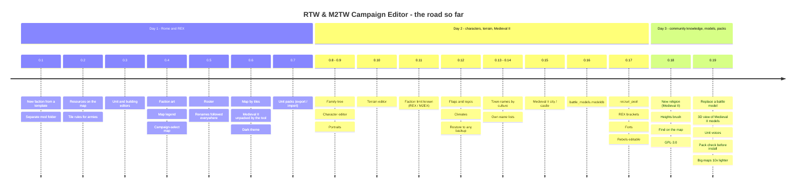

# Roadmap

Where RTW & M2TW Campaign Editor stands, what comes next and what each step needs.
📦 built and released (delivered) · ✅ built, released and confirmed in the game · 🧪 released, being tested in the game now ·
🔜 next · 💡 later. Updated with every release
(see [CHANGELOG.md](CHANGELOG.md) for the details).

Found a bug or a crash? Send the logs (**Tools → Save logs (zip)**) and a screenshot or a short video -
that is the fastest way to a fix.

## Where it started

Version 0.1: a small script for one mod (Barbarian Empires REX on Rome: Total War) that cloned a faction
from a template - texts, units, buildings, start towns, leader. Rome only, command line first.

## The road so far

37 releases in the first three days (0.1.0 → 0.19.0), from a one-mod faction cloner to a campaign editor for
two games.

| Area | Confirmed in game | Released | Being tested | Next |
|---|---|---|---|---|
| Factions | new faction, faction limit, edit, garrisons, mod folder | settlement size, rebels, diplomacy, roster | - | factions that appear later |
| Campaign map | tiles, moving towns, new regions, terrain, heights, find, town names | resources, climates, forts, big maps | the ring round a town | a new map from scratch, the coast |
| Characters | - | name lists | character editor, family tree, portraits | - |
| Units, buildings, art | faction art | editors, unit packs, modeldb, REX abilities | replace a model, 3D view, new unit / building step by step, unit voices | Rome .cas in 3D |
| Both games | Rome / BI / Alexander, city ↔ castle | Medieval II and Kingdoms | new religion | REX settings panel |
| Safety | - | preview, backup, byte-exact restore, Check / Scan mod | pack check | signed exe |

## What it does now (0.19.2)

### Factions
- ✅ New faction from a template: names, texts, colours, units, buildings, cards, name lists, traits, art *(in-game ✓)*
- ✅ Faction limit known and raised with a yes (REX / M2EX `max_factions`) *(in-game ✓ on Rome + REX)*
- ✅ Edit an existing faction: names, texts, colours, AI, money, playable, towns taken or given, capital, leader and heir *(in-game ✓)*
- ✅ Garrisons and buildings per town, with the game's own cards and pictures *(in-game ✓)*
- 📦 Settlement level and population (the governor's building follows the size)
- 📦 The rebels edited like any faction: armies, fleets, garrisons, towns, units (each rebel with its `sub_faction`)
- 📦 Diplomacy: attitudes and starting relations with every other faction
- 📦 Roster: give or take units and building levels (ownership, recruit lines and cards kept in step)
- ✅ A separate mod folder in one click (the base mod stays untouched) *(in-game ✓)*

### Campaign map
- ✅ The map drawn tile by tile from the game's own map files; political, diplomacy and region colours *(in-game ✓)*
- 📦 Characters on the map: drag to move, new armies, agents and fleets placed by clicking
- ✅ Move towns and ports (roads and sea routes follow) *(in-game ✓)*
- ✅ Paint new regions and move borders *(in-game ✓ on HLR)*
- 📦 Edit a region's data (builder, rebels, tags, triumph, farming), new or existing
- 📦 Map changes, new regions and faction changes written together by one Apply
- 📦 Resources placed, moved and removed; religions per region (Medieval II)
- ✅ Terrain editor: paint ground types, rivers, fords, river sources and cliffs tile by tile *(in-game ✓ on Rome and Medieval II; [video](https://youtu.be/z0T723riXaU))*
- ✅ Terrain editor: heights brush like a spray can - raise, lower, smooth, level (`map_heights.hgt` kept in step) *(in-game ✓ on Rome and Medieval II; [video](https://youtu.be/mTdRAWympuw))*
- ✅ Find on the map: towns, ports, armies, agents, fleets, units, forts, resources *(in-game ✓ on Rome and Medieval II; [video](https://youtu.be/6WAdnGovGzA))*
- 📦 Terrain editor: paint climates (`map_climates.tga`, the mod's own climates)
- 📦 Rivers kept joined side to side (the game stops a river at a corner-only step); Preview names a river the game will not draw
- ✅ Settlement names by the owner's culture (REX / M2EX rename a town when it changes hands); the map shows the new owner's name at once; every town's names in one table *(in-game ✓ on Medieval II with M2EX; [video](https://youtu.be/umwRyWkHoDE))*
- 📦 Big maps load (a tester's map of 5456 x 2464 tiles)
- 📦 Forts and watchtowers shown on the map; no one is placed on them

### Characters
- 📦 Character editor for any faction: names, ages, traits with levels, ancillaries
- 📦 A faction's own name list (men, surnames, women) typed in three steps
- 📦 Family tree drawn like the game's (couples, children, leader and heir); give a wife, add a child, rename (followed on the tree)
- 📦 Portraits on the tree as the game shows them; Medieval II characters get portraits of their own
- 📦 Portrait library: every portrait of a culture, add new ones (sized and numbered for the game)

### Units, buildings, art
- 📦 Unit and building editors: every line as a field, add / remove lines, copy as new, renames followed everywhere
- 📦 Pictures imported into the right place in the right size and format (cards, building pictures, faction art)
- 📦 Medieval II recruitment (`recruit_pool`) and REX's retrain-only lines read and written everywhere
- 📦 REX's bracket requirements: several faction groups on one line, each with its own conditions
- 📦 Unit editor: REX's unit abilities ticked with their effect in plain words (morale, fatigue, charge, terrain, garrison, shield piercing...)
- 📦 Unit packs: export units with models, textures, mounts, cards and texts into a .zip and import them into another mod
- 📦 Medieval II `battle_models.modeldb`: a new faction gets its template's textures in every battle model; unit packs carry their modeldb models (renamed on clashes, textured for every new owner)
- ✅ Faction art: every picture of a faction listed with where the game shows it, Replace... *(in-game ✓)*; a new faction's banners and logo are its own files; Back to the original
- 📦 Campaign-select map drawn from the faction's towns (optional; the original stays by default)
- 📦 Rome: the flag symbol on the campaign map and the faction logos, each faction its own, Replace... in the Art tab

### Both games
- ✅ Rome: Total War, Barbarian Invasion, Alexander - plain or on REX *(in-game ✓)*
- 📦 Medieval II and Kingdoms - plain or on M2EX: unpacking offered, set-up fixes, castles, `mods/<name>` with its .cfg
- ✅ Medieval II: turn a settlement into a castle or a city (buildings converted the game's own way) *(in-game ✓ loads)*

### Safety
- 📦 Preview of every file and line before writing; only the lines meant change, the rest stays byte for byte
- 📦 A backup of every write; Restore gives the original back byte for byte (any write and every later one in one go); Undo / Redo in the window
- 📦 Check mod (consistency report), Scan mod (every mention of a faction; game, REX and mod files told apart)
- 📦 Log, Save logs (zip) for bug reports; Light / Dark look; smaller windows keep every button, side panels can be dragged wider

## 🧪 Being tested in the game now

- 🧪 A new religion for Medieval II (0.18.0): New religion... on the Map tab; Medieval II rebels' new armies, agents and fleets (0.18.0 fix)
- 🧪 From the modders' guides (0.18.0): off-map sons kept at 16 or younger; flag symbols from descr_standards.txt (BI's sheets, never a rebels' slot); river blocks and rings warned; Check mod counts the engine's limits and finds win conditions / rebels / slaves faults
- 🧪 The rebels in Edit faction (0.17.1)
- 🧪 Medieval II recruit_pool lines; REX bracket requirements and unit abilities; forts on the map (0.17.0)
- 🧪 Family tab and Character editor, own portraits (Medieval II), portrait library
- 🧪 Edit region; a new faction starting in a new region in one Apply
- 🧪 Medieval II castle fix (0.7.5), unit packs, new armies / agents / fleets on the map
- 🧪 Barbarian Invasion campaign loading (0.9.4 fix); BI's shared name lists and building pictures (0.12.0)
- 🧪 Terrain climates; Rome flag symbols and faction logos (0.12.0)
- 🧪 Check and install a pack (Tools): every file of a "copy data over the game" mod checked - REX's own files, pictures of another size, whole text files - and put in as picked, with a backup (0.19.0)
- 🧪 Medieval II new faction named in battle banners, accents, one-liners, movies and music; the ring round a town (no other region, no port next to a town on Medieval II) checked when moving towns / ports, painting regions and in Check mod (0.19.0)
- 🧪 Replace a unit's battle model (Unit editor, Battle model: Replace model...) - from this mod or another mod of the same game, with its files; the unit's factions get textures; a model made to sit otherwise (foot / horse / camel / elephant / chariot) is warned about (0.19.0)
- 🧪 Medieval II battle_models.modeldb: clone and unit packs (0.16.0)
- 🧪 Medieval II city / castle switch (0.15.0)
- 🧪 Own name lists, the names-by-culture table (0.14.0)
- 🧪 Settlement names by culture on Rome with REX (0.13.0); a New mod folder from BI / Alexander started with -bi / -alx
- 🧪 New unit / New building step by step (Unit and Building editors): Back / Next between the steps, every file shown before it is added (0.19.0)
- 🧪 Hear a unit and give it a voice (Unit editor, Voice in battle): its name call and orders played from the game's packs, your own .wav as its name call (0.19.2)
- 🧪 Big maps: a 4080 x 2496 map opens in 2 s and 0.6 GB (was 38 s and 6.6 GB); region painting checked in a moment (0.19.0)

## 🔜 Next

| Step | What it needs |
|---|---|
| Signed exe (no browser / SmartScreen warnings) | SignPath Foundation's answer (applied) |
| Terrain: mountains and hills kept in step with the heights (a mountain tile raises the land) | Time; an in-game test |
| Terrain: a tilted 3D-like preview from the heights and ground | Time |
| Terrain: the coast (land and sea swapped, with regions and heights); a new climate of one's own | Time; in-game tests |
| A new campaign map from scratch (one region, one faction, loads in the game), then grown in the editor | Time; in-game tests |
| Unit editor: Rome's .cas battle models in 3D (Medieval II's .mesh is done) | Rome .cas files to learn the format on |
| Faction packs and building packs (like unit packs) | Time; then an in-game test |
| Mods made on the plain game (slimmed folders) loaded with the game's data behind them | Time |
| Check mod: the crash rules modders documented (undeclared ai_label, religions not summing to 100, a region with no town not last, event texts, antitraits, dead ancillaries, absolute paths, a town touching another region) | Time |
| Limits shown up front on the original exes (REX / M2EX lift most): units (500), building chains (64 Rome / 128 Medieval II), levels (9), religions (9) | Time |
| Roster: giving a building level also gives the levels below it (a chain is built level by level); taking one also takes the levels above | Time |
| A religion of one's own, step by step in its own window: name, symbol, text, its temple chain (levels, pictures, effects like the Building editor), which factions follow it - Medieval II and Barbarian Invasion (BI's `descr_beliefs.txt`, `religious_belief` in the buildings); greyed on plain Rome, which has no religions | Time; BI's campaign files for the test |
| Factions that appear later, each game its own way: Medieval II by date (`dead_until_resurrected`, `spawned_on_event`, an `emergent_faction` event with its regions, armies spawned by the campaign script - like the Mongols and Timurids); Barbarian Invasion hordes (`horde_*` lines) and factions born of a revolt (`spawns_on_revolt`, `shadowed_by`) | Time; in-game tests |
| Shadow and emergent factions set in the tool (BI `shadowed_by` / `shadowing`, `spawned_on_event`, Medieval II `dead_until_resurrected`, `undiscovered`) | Time; an in-game test |
| Terrain: a 3D view (asked on Discord again) | Time |
| A faction brought over from Rome into Barbarian Invasion (or between any two Rome mods): a faction pack - its units already go over as unit packs | Time; then an in-game test |
| A REX settings panel in plain words (faction limit, sprites, arrow visibility, fort upkeep, trade fleets...) | Time |
| Forts placed and edited on the map (REX: permanent, a name of its own) | Time; an in-game test |
| The AI's war plans (`invade_*` in descr_campaign_ai_db.xml) explained in plain words on the Faction tab | Time |
| Open the mod in the game's own campaign-map editor (`REX.exe -strat_ed=a`, M2EX) | Time |

## 💡 Later

| Step | What it needs |
|---|---|
| A culture of its own (buildings, settlements, sounds, and optionally its own interface look - the panels' pictures in `ui/<culture>/interface`), made like a faction clone from a template culture | Whether REX / M2EX limit the number of cultures (HLR runs 11 under REX); the custom-battle culture list is fixed in the game |
| Rescale the whole campaign map (e.g. 2x, with towns, armies and resources moved along) | The map size limits of REX and M2EX; in-game tests |
| Unit texture recolour to a faction's colours; a model viewer | Texture and model files to work on |
| Rome characters with portraits of their own | Whether REX reads a `portrait` line |
